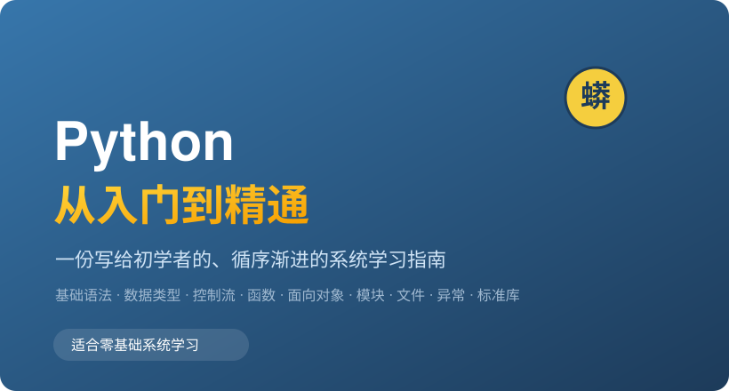
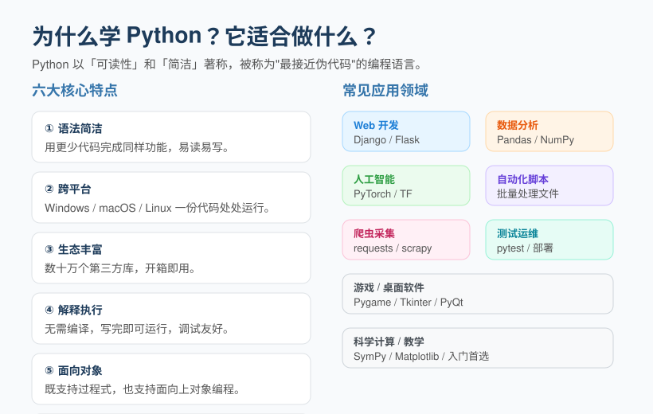
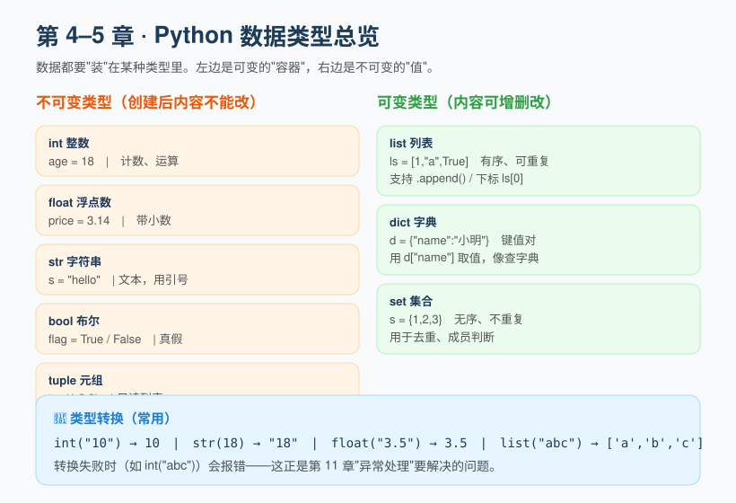
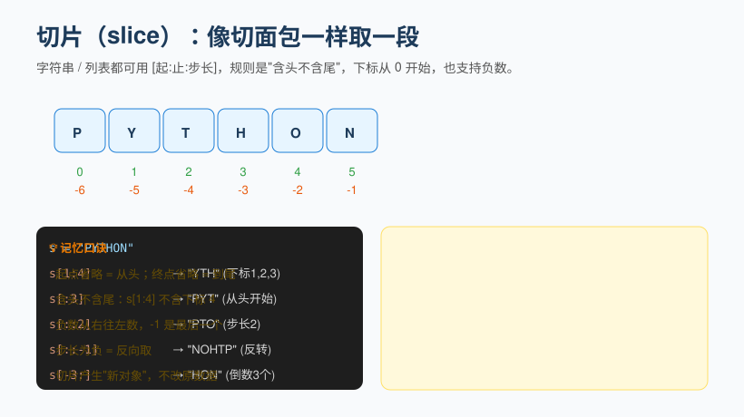
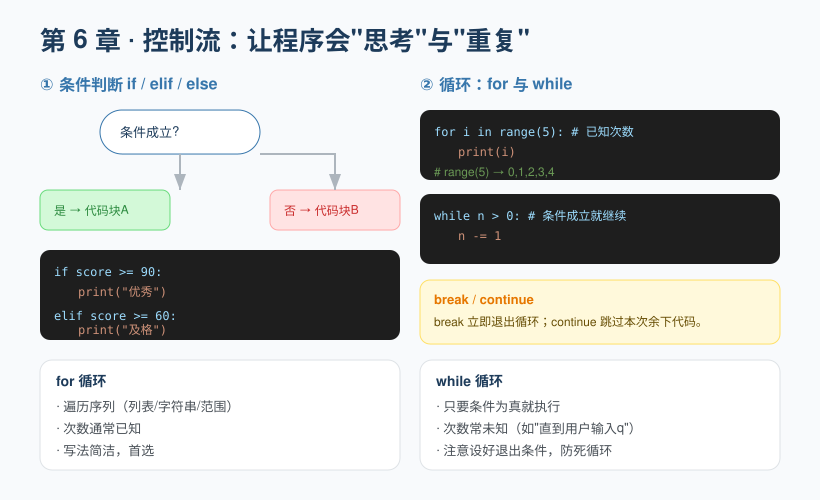
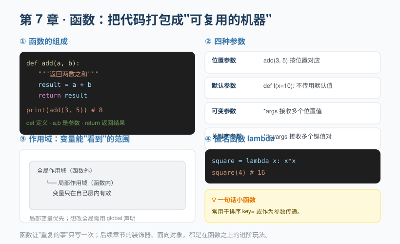
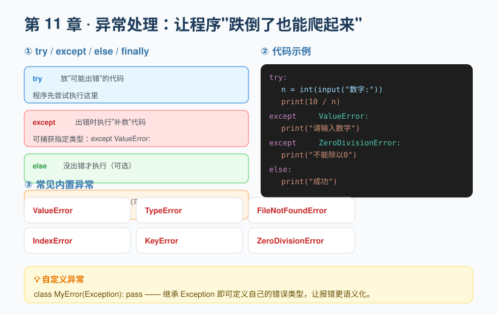
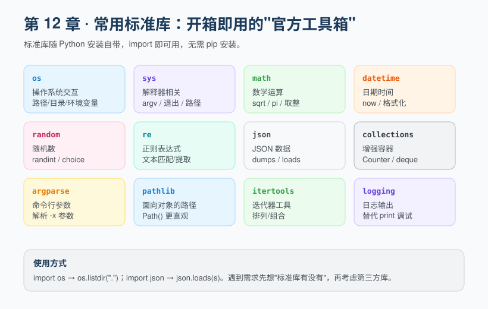
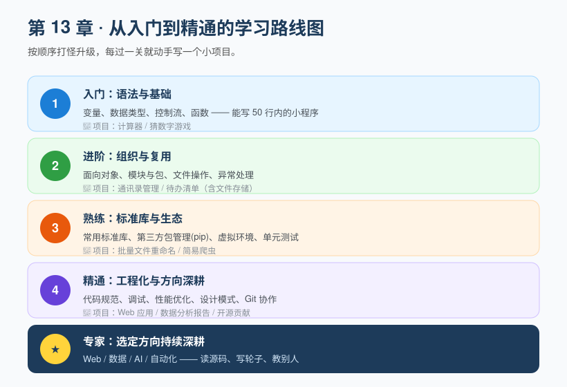
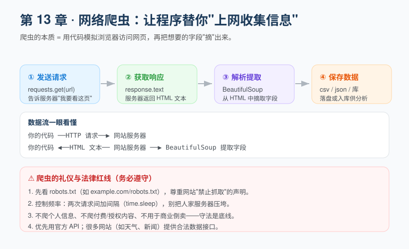

> 一份循序渐进、零基础友好的 Python 系统教程，每一节均为「中文讲解 + 英文对照」。
> A step-by-step, beginner-friendly systematic Python tutorial — every section is "Chinese explanation + English translation".

> 本仓库（README）即全文。目录见下方，点击可跳转到对应章节。
> This repository's README **is** the full text. See the table of contents below; click to jump to each chapter.

> 📦 想按章节阅读或离线收藏？完整教程（15 章 + 附录 + 20 张配图）已打包发布在 **[Releases](https://github.com/W-zc-lang/python-from-zero-to-hero/releases)**，可一键下载。
> 📦 Prefer reading by chapter or offline? The complete tutorial (15 chapters + appendix + 20 diagrams) is packaged in **[Releases](https://github.com/W-zc-lang/python-from-zero-to-hero/releases)** — download it there.

# Python 从入门到精通

**Python: From Beginner to Master**

> 一份写给初学者的、循序渐进的系统学习指南
>
> 覆盖：基础语法 · 数据类型 · 控制流 · 函数 · 面向对象 · 模块与包 · 文件操作 · 异常处理 · 常用标准库 · 网络爬虫 · 自动化办公
>
> 适合人群：零基础或有一点编程经验、希望系统掌握 Python 的读者。

> A step-by-step, systematic learning guide written for beginners
>
> Covering: basic syntax · data types · control flow · functions · object-oriented programming · modules and packages · file operations · exception handling · common standard libraries · web scraping · office automation
>
> Who it's for: readers with no prior experience, or a little programming background, who want to master Python systematically.



---

## 目录

**Table of Contents**

1. [走进 Python：为什么学、学什么、怎么学](#第-1-章-走进-python为什么学学什么怎么学)
1. [Getting Started with Python: Why, What, and How to Learn](#第-1-章-走进-python为什么学学什么怎么学)
2. [环境搭建：安装 Python 与开发工具](#第-2-章-环境搭建安装-python-与开发工具)
2. [Environment Setup: Installing Python and Development Tools](#第-2-章-环境搭建安装-python-与开发工具)
3. [基础语法：变量、注释、缩进、输入输出](#第-3-章-基础语法变量注释缩进输入输出)
3. [Basic Syntax: Variables, Comments, Indentation, Input and Output](#第-3-章-基础语法变量注释缩进输入输出)
4. [数据类型（一）：数字、字符串、布尔](#第-4-章-数据类型一数字字符串布尔)
4. [Data Types (1): Numbers, Strings, Booleans](#第-4-章-数据类型一数字字符串布尔)
5. [数据类型（二）：列表、元组、集合、字典](#第-5-章-数据类型二列表元组集合字典)
5. [Data Types (2): List, Tuple, Set, Dict](#第-5-章-数据类型二列表元组集合字典)
6. [控制流：条件判断与循环](#第-6-章-控制流条件判断与循环)
6. [Control Flow: Conditionals and Loops](#第-6-章-控制流条件判断与循环)
7. [函数：封装可复用的代码](#第-7-章-函数封装可复用的代码)
7. [Functions: Encapsulating Reusable Code](#第-7-章-函数封装可复用的代码)
8. [面向对象编程：用类与对象组织代码](#第-8-章-面向对象编程用类与对象组织代码)
8. [Object-Oriented Programming: Organizing Code with Classes and Objects](#第-8-章-面向对象编程用类与对象组织代码)
9. [模块与包：组织大型项目](#第-9-章-模块与包组织大型项目)
9. [Modules and Packages: Organizing Large Projects](#第-9-章-模块与包组织大型项目)
10. [文件操作：读写数据](#第-10-章-文件操作读写数据)
10. [File Operations: Reading and Writing Data](#第-10-章-文件操作读写数据)
11. [异常处理：让程序更健壮](#第-11-章-异常处理让程序更健壮)
11. [Exception Handling: Making Programs More Robust](#第-11-章-异常处理让程序更健壮)
12. [常用标准库：站在巨人的肩膀上](#第-12-章-常用标准库站在巨人的肩膀上)
12. [Common Standard Libraries: Standing on the Shoulders of Giants](#第-12-章-常用标准库站在巨人的肩膀上)
13. [进阶与精通之路](#第-13-章-进阶与精通之路)
13. [The Path to Advanced and Proficient Python](#第-13-章-进阶与精通之路)
14. [网络爬虫：让程序替你上网收集信息](#第-14-章-网络爬虫让程序替你上网收集信息)
14. [Web Scraping: Let Programs Collect Information Online for You](#第-14-章-网络爬虫让程序替你上网收集信息)
15. [自动化办公：把重复劳动交给 Python](#第-15-章-自动化办公把重复劳动交给-python)
15. [Office Automation: Hand Repetitive Work Over to Python](#第-15-章-自动化办公把重复劳动交给-python)
16. [附录：常见错误与调试、推荐资源](#附录常见错误与调试推荐资源)
16. [Appendix: Common Errors, Debugging, Recommended Resources](#附录常见错误与调试推荐资源)

---

## 第 1 章 走进 Python：为什么学、学什么、怎么学

**Chapter 1: Getting Started with Python: Why, What, and How to Learn**

很多初学者在翻开第一本编程书之前，心里都会冒出两个问题：**"我能不能学会？"** 以及 **"学这个到底有什么用？"**

Before opening their first programming book, most beginners have two questions on their mind: **"Can I actually learn this?"** and **"What is it really good for?"**

先给第一个问题的答案：能。Python 是所有主流编程语言里对初学者最友好的之一。它的语法读起来几乎像英文句子，写起来不需要记忆大量符号规则，能让你的注意力集中在"解决问题"本身，而不是"和语法搏斗"。

Here's the answer to the first one: yes, you can. Python is one of the most beginner-friendly of all mainstream programming languages. Its syntax reads almost like English sentences, and writing it doesn't require memorizing a pile of symbol rules—so your attention stays on *solving the problem* instead of *wrestling with syntax*.

### 1.1 Python 是什么

**1.1 What Is Python**

Python 是一门**解释型、高级、通用**编程语言。

Python is an **interpreted, high-level, general-purpose** programming language.

- **解释型**：你写完代码，不需要像 C/C++ 那样先"编译"成机器码，而是直接交给 Python 解释器运行。写一句、跑一句，调试特别方便。
- **Interpreted**: once you've written your code, you don't need to "compile" it into machine code as you would in C/C++—you hand it straight to the Python interpreter to run. Write a line, run a line: debugging is remarkably convenient.
- **高级**：它帮你屏蔽了内存管理、指针等底层细节，让你用更接近人类思维的方式表达逻辑。
- **High-level**: it hides low-level details such as memory management and pointers, letting you express logic in a way much closer to human thinking.
- **通用**：从网站、数据分析到人工智能、自动化脚本，几乎无所不能。
- **General-purpose**: from websites and data analysis to artificial intelligence and automation scripts, it can do just about anything.

### 1.2 为什么选 Python

**1.2 Why Choose Python**



简单概括，Python 最大的优势是**"用最少的代码，做最多的事"**。举个真实对比：同样是把一个文件夹里的所有 `.txt` 文件重命名，用某些语言要写几十行，用 Python 可能只要几行。

In short, Python's greatest strength is **"doing the most with the least code."** Here's a real comparison: to rename every `.txt` file in a folder, some languages need dozens of lines—Python may need only a few.

它还有两个对学习者极友好的特质：

It also has two qualities that are extremely friendly to learners:

1. **可读性极强**——代码即文档，别人（甚至几周后的你）能看懂。
1. **Highly readable**—the code is its own documentation, so others (and even you, weeks later) can still understand it.
2. **生态极其丰富**——你想做的几乎任何事，都有现成的库可以直接用。
2. **An extremely rich ecosystem**—for almost anything you want to do, there's already a library you can use directly.

### 1.3 学 Python 能做什么

**1.3 What You Can Do with Python**

| 方向 | 典型用途 | 常用库 |
| --- | --- | --- |
| Web 开发 | 网站后端、接口服务 | Django、Flask、FastAPI |
| 数据分析 | 清洗、统计、可视化 | Pandas、NumPy、Matplotlib |
| 人工智能 | 机器学习、深度学习 | PyTorch、TensorFlow |
| 自动化 | 批量处理文件、爬虫 | os、requests、BeautifulSoup |
| 测试运维 | 自动化测试、部署脚本 | pytest、fabric |

| Field | Typical Uses | Common Libraries |
| --- | --- | --- |
| Web Development | Website backends, API services | Django, Flask, FastAPI |
| Data Analysis | Cleaning, statistics, visualization | Pandas, NumPy, Matplotlib |
| Artificial Intelligence | Machine learning, deep learning | PyTorch, TensorFlow |
| Automation | Batch file processing, web scraping | os, requests, BeautifulSoup |
| Testing & Ops | Automated testing, deployment scripts | pytest, fabric |

### 1.4 怎么学最有效

**1.4 How to Learn Most Effectively**

记住一句话：**看懂 ≠ 学会，写会才是真的会。** 本书每章都配有可运行的代码示例，请务必打开电脑亲手敲一遍、改一改、看看报错长什么样。遇到不懂的，先自己试，再查资料，最后提问——这个"试错—查错"的过程，正是编程能力增长的来源。

Remember this: **understanding ≠ knowing; you only truly know it once you can write it.** Every chapter of this book comes with runnable code examples, so do open your computer, type them out yourself, tweak them, and see what the errors look like. When something puzzles you, try it yourself first, then look it up, and ask for help last—this cycle of "trial and error, then diagnosis" is exactly where programming skill comes from.

---

## 第 2 章 环境搭建：安装 Python 与开发工具

**Chapter 2: Environment Setup: Installing Python and Development Tools**

在写第一行代码前，我们需要先把"厨房"准备好：安装 Python 解释器（相当于灶台），并选一个顺手的编辑器（相当于锅铲）。

Before writing our first line of code, we need to get the "kitchen" ready: install the Python interpreter (the stove) and pick an editor that feels comfortable (the spatula).

### 2.1 安装 Python

**2.1 Installing Python**

1. 打开浏览器访问 [python.org](https://www.python.org)，点击 **Downloads**，网站会自动推荐适合你系统的版本（Windows / macOS / Linux）。
1. Open your browser and go to [python.org](https://www.python.org), click **Downloads**, and the site will automatically recommend the right version for your system (Windows / macOS / Linux).
2. 下载并运行安装包。
2. Download and run the installer.
3. **最关键的一步**：在安装界面底部，务必勾选 **"Add Python to PATH"**（把 Python 加到环境变量），否则装完后在命令行里敲 `python` 会提示"找不到命令"。
3. **The most critical step**: at the bottom of the installer window, be sure to check **"Add Python to PATH"**, otherwise typing `python` in the command line after installation will report "command not found."

> 建议安装 **Python 3.10 及以上**版本。注意：Python 2 已经在 2020 年停止维护，请务必使用 Python 3。

> We recommend installing **Python 3.10 or later**. Note: Python 2 reached end of life in 2020, so be sure to use Python 3.

### 2.2 验证安装

**2.2 Verifying the Installation**

安装完成后，打开**终端**（Windows 叫"命令提示符"或 PowerShell，macOS 叫"终端"），输入：

Once installation is complete, open a **terminal** (called "Command Prompt" or PowerShell on Windows, "Terminal" on macOS) and type:

```bash
python --version
```

如果看到类似 `Python 3.12.1` 的输出版本号，恭喜，灶台点着了。

If you see a version number like `Python 3.12.1`, congratulations—the stove is lit.

> 个别系统（如 macOS）可能需要输入 `python3 --version`。后文统一用 `python`，如果你的系统认 `python3`，请自行替换。

> On some systems (such as macOS) you may need to type `python3 --version`. The rest of this book uses `python` throughout; if your system expects `python3`, substitute it accordingly.

### 2.3 选择编辑器

**2.3 Choosing an Editor**

- **VS Code（强烈推荐初学者）**：免费、轻量、插件丰富，装上 Python 插件后拥有智能提示、调试、运行一体化体验。
- **VS Code (highly recommended for beginners)**: free, lightweight, and rich in extensions—install the Python extension and you get code completion, debugging, and running all in one place.
- **PyCharm**：功能更全的专用 IDE，社区版免费，适合后续做大型项目。
- **PyCharm**: a more fully featured dedicated IDE, free in the Community Edition, well suited to larger projects later on.
- 哪怕是系统自带的"记事本"也能写，但**强烈不建议**——没有语法高亮和提示，容易因为看不见的小错误抓狂。
- You *can* even write code in the built-in Notepad, but this is **strongly discouraged**—without syntax highlighting or hints, tiny invisible mistakes will drive you up the wall.

### 2.4 跑通第一行代码

**2.4 Running Your First Line of Code**

新建一个文件，命名为 `hello.py`，输入以下内容（也可以直接参考下面的代码截图）：

Create a new file named `hello.py` and enter the following (you can also refer to the code screenshot below):


```python
# 这是一行注释，程序不会执行它
print("Hello, Python!")

name = "小明"
print("你好，", name)

# 用 input 接收用户输入
age = input("请输入年龄: ")
```

在终端进入该文件所在目录，运行：

In the terminal, navigate to the directory containing the file and run:

```bash
python hello.py
```

看到输出，说明你的开发环境已经完全就绪。

Once you see the output, your development environment is fully ready.


---

## 第 3 章 基础语法：变量、注释、缩进、输入输出

**Chapter 3: Basic Syntax: Variables, Comments, Indentation, Input and Output**

任何编程语言都有"基本功"。Python 的基本功可以浓缩为三件事：**怎么写注释、怎么用缩进、怎么存数据和交互**。

Every programming language has its fundamentals. Python's boil down to three things: **how to write comments, how to use indentation, and how to store data and interact with the user**.

### 3.1 变量：装数据的"盒子"

**3.1 Variables: "Boxes" That Hold Data**

变量就是给数据贴的一个名字标签。你不需要提前声明"这个变量是什么类型"，直接赋值就行：

A variable is simply a name tag attached to a piece of data. You don't need to declare "what type this variable is" in advance—just assign a value:

```python
age = 18          # 整数
price = 9.9       # 浮点数
name = "小明"      # 字符串
is_student = True # 布尔值
```

`=` 在编程里叫**赋值运算符**，意思是"把右边的值，装进左边的盒子"。注意它和数学里的"等于"不同——`x = x + 1` 在程序里完全合法，意思是"取 x 当前的值加 1，再存回 x"。

In programming, `=` is called the **assignment operator**, meaning "put the value on the right into the box on the left." Note that this differs from "equals" in mathematics—`x = x + 1` is perfectly legal in a program, and it means "take x's current value, add 1, and store the result back into x."

变量命名规则：

Rules for naming variables:

- 只能包含字母、数字、下划线，且**不能以数字开头**（`2name` ❌，`name2` ✅）。- 区分大小写：`Age` 和 `age` 是两个不同的变量。
- Names may contain only letters, digits, and underscores, and **must not start with a digit** (`2name` ❌, `name2` ✅). - Names are case-sensitive: `Age` and `age` are two different variables.
- 不能用 Python 的**关键字**（如 `if`、`for`、`class`）做名字。
- You cannot use Python **keywords** (such as `if`, `for`, `class`) as names.
- 推荐使用**小蛇式命名**：`student_count`、`user_name`，全小写加下划线，清晰易懂。
- Prefer **snake_case**: `student_count`, `user_name`—all lowercase with underscores, clear and easy to read.

### 3.2 注释：写给人看的说明

**3.2 Comments: Notes Written for Humans**

注释是写给读代码的人（包括未来的你）看的，程序运行时会直接忽略它。

Comments are written for whoever reads the code (including your future self); the program ignores them entirely at runtime.

```python
# 这是单行注释，以 # 开头

"""
这是多行注释，
用三个引号（单双都可）包裹，
常用于函数或文件的说明
"""
```

好的注释不是解释"代码做了什么"（代码自己会说话），而是解释"**为什么**要这么做"。

A good comment doesn't explain *what* the code does (the code speaks for itself)—it explains **why** it's done that way.

### 3.3 缩进：Python 的"大括号"

**3.3 Indentation: Python's "Curly Braces"**

很多语言用 `{}` 来表示"哪些代码属于一起"，而 Python 用**缩进**（行首的空格）。这是 Python 最与众不同、也最干净的设计：

Many languages use `{}` to mark "which lines of code belong together," whereas Python uses **indentation** (spaces at the start of a line). This is Python's most distinctive—and cleanest—design decision:


```python
if score >= 60:
    print("及格")        # 这行缩进了，属于 if 代码块
    print("恭喜")        # 同样缩进，也属于 if
print("这句话没有缩进")   # 这行顶格，无论 if 是否成立都会执行
```

**缩进规则要点**：

**Key points about indentation**:

- 同一代码块内的缩进量必须一致（通常 4 个空格，不要用 Tab 和空格混用）。
- Indentation must be consistent within the same block (usually 4 spaces—never mix tabs and spaces).
- 推荐用编辑器自动把 Tab 转成 4 个空格，避免"看起来对齐实则没对齐"的报错。
- Configure your editor to convert tabs into 4 spaces automatically, to avoid errors where code "looks aligned but isn't."

### 3.4 输入与输出

**3.4 Input and Output**

- `print(...)` 把内容显示在屏幕上。
- `print(...)` displays content on the screen.
- `input("提示语")` 暂停程序，等用户从键盘输入，并把输入内容作为**字符串**返回。
- `input("prompt")` pauses the program, waits for the user to type on the keyboard, and returns what they entered as a **string**.

```python
name = input("你叫什么名字？")
print("你好，", name)
```

> 注意：`input()` 永远返回字符串。如果你想做数学运算，记得用 `int()` 或 `float()` 转换类型，比如 `age = int(input("年龄："))`。

> Note: `input()` always returns a string. If you want to do arithmetic, remember to convert the type with `int()` or `float()`, for example `age = int(input("年龄："))`.

### 3.5 变量的底层细节：id、is 与 ==、可变与不可变

**3.5 Under the Hood: id, is vs. ==, Mutable vs. Immutable**

很多初学者以为"变量是一个装数据的盒子"，这个比喻好懂但并不完整。更准确地说：**变量是贴在对象上的"标签"，真正的对象存在于内存里。**

Many beginners picture a variable as "a box holding data." That metaphor is easy to grasp but incomplete. More precisely: **a variable is a "label" stuck onto an object, while the object itself lives in memory.**

```python
x = 10
print(id(x))        # 打印 x 指向的对象在内存里的"身份证号"
y = x
print(x is y)       # True   —— is 判断"是不是同一个对象"
print(x == y)       # True   —— == 判断"值是否相等"
```

要点：

Key points:

- `id()` 返回一个对象在内存中的唯一编号；`is` 比较编号（是否为同一对象），`==` 比较值。
- `id()` returns an object's unique number in memory; `is` compares those numbers (whether they are the same object), while `==` compares values.
- 把变量赋给另一个变量（`y = x`），只是让 `y` 也贴上同一个对象，**并不会复制一份**。
- Assigning one variable to another (`y = x`) merely attaches `y` to the same object—it **does not make a copy**.
- 因此**可变对象**（列表、字典、集合）被多个变量指向时，改一个全都跟着变；**不可变对象**（数字、字符串、元组）"改不了"，任何"修改"其实都生成了新对象。
- Consequently, when a **mutable object** (list, dict, set) is referenced by several variables, changing it through one of them changes it for all; **immutable objects** (numbers, strings, tuples) "can't be changed"—any apparent "modification" actually creates a new object.

```python
s = "abc"
t = s
s = s + "d"         # 字符串不可变，这里生成新对象 "abcd"，t 仍指向旧对象
print(t)            # abc   t 不受影响

a = [1, 2]
b = a
b.append(3)
print(a)            # [1, 2, 3]   a 被牵连，因为 a、b 指向同一个列表
```

> ⚠️ **常见误区**：用 `is` 比较值。例如 `a = 257; b = 257; a is b` 可能返回 `False`（Python 只缓存了小整数 -5~256）。比较值永远用 `==`。

> ⚠️ **Common pitfall**: using `is` to compare values. For example, `a = 257; b = 257; a is b` may return `False` (Python only caches small integers from -5 to 256). Always use `==` to compare values.

> ✏️ **小练习**：定义 `a = [1, 2]; b = a; b[0] = 99`，打印 `a` 并解释为什么它变了；再试 `a = 5; b = a; b = 6`，打印 `a` 看是否变化，对比两者的差异。

> ✏️ **Exercise**: define `a = [1, 2]; b = a; b[0] = 99`, print `a`, and explain why it changed; then try `a = 5; b = a; b = 6`, print `a` to see whether it changed, and compare the difference between the two cases.

---

## 第 4 章 数据类型（一）：数字、字符串、布尔

**Chapter 4: Data Types (1): Numbers, Strings, Booleans**

数据在程序里都要"装"在某种类型里。Python 的数据类型可以分为**不可变类型**（内容创建后不能改）和**可变类型**（内容可增删改）。本章先讲不可变的三种基础类型。

In a program, every piece of data has to be "held" in some type. Python's data types fall into **immutable types** (contents can't change once created) and **mutable types** (contents can be added to, removed, or modified). This chapter covers the three basic immutable types first.

### 4.1 数字：int 与 float

**4.1 Numbers: int and float**

```python
a = 10        # int 整数
b = 3.14      # float 浮点数（带小数）

print(a + b)  # 13.14  加法
print(a - b)  # 6.86   减法
print(a * b)  # 31.4   乘法
print(a / b)  # 3.18... 除法（结果永远是 float）
print(a // 3) # 3      整除（丢弃小数）
print(a % 3)  # 1      取余
print(a ** 2) # 100    幂运算（a 的 2 次方）
```

常用数学函数（来自标准库 `math`，详见第 12 章）：

Common math functions (from the `math` standard library—see Chapter 12 for details):

```python
import math
print(math.sqrt(16))  # 4.0  开方
print(math.floor(3.9))# 3    向下取整
print(math.ceil(3.1)) # 4    向上取整
print(math.pi)        # 3.141592... 圆周率
```

### 4.2 字符串：str

**4.2 Strings: str**

字符串是用**单引号 `'` 或双引号 `"`** 包裹的文本。

A string is text wrapped in **single quotes `'` or double quotes `"`**.

```python
s = "Hello, Python"
print(len(s))          # 13        字符串长度
print(s.upper())       # HELLO, PYTHON  转大写
print(s.lower())       # hello, python  转小写
print(s.replace("Python", "World"))  # Hello, World  替换
print("Py" in s)       # True  判断是否包含子串
```

**字符串拼接与格式化**（非常重要，日常高频）：

**String concatenation and formatting** (very important, used constantly in daily work):

```python
name = "小明"
age = 18

# 方式一：f-string（推荐，最直观，Python 3.6+）
print(f"{name}今年{age}岁")          # 小明今年18岁

# 方式二：.format()
print("{}今年{}岁".format(name, age))

# 方式三：拼接（注意类型要一致）
print(name + "今年" + str(age) + "岁")
```

> f-string 是目前最推荐的写法：在字符串前加 `f`，用 `{变量}` 直接嵌入，既清晰又不易出错。

> The f-string is currently the most recommended approach: put an `f` before the string and embed values directly with `{variable}`—it's both clear and less error-prone.

**字符串切片**（截取其中一段）：

**String slicing** (extracting a section of it):

```python
s = "abcdef"
print(s[0])     # a    取下标 0（第一个）
print(s[1:4])   # bcd  取下标 1 到 3（含头不含尾）
print(s[:3])    # abc  从头取到下标 2
print(s[::2])   # ace  每隔一个取一个
print(s[::-1])  # fedcba  反转字符串
```

下标从 0 开始数，这是编程世界的通用约定，务必适应。

Indexing starts at 0—a universal convention in the programming world, so get used to it.

### 4.3 布尔：bool

**4.3 Booleans: bool**

布尔类型只有两个值：`True`（真）和 `False`（假），常用于条件判断。

The boolean type has only two values—`True` and `False`—and is mainly used in conditional tests.

```python
print(3 > 2)    # True
print(3 == 2)   # False  注意：判断相等用 ==，一个 = 是赋值
print(3 != 2)   # True   不等于
print(3 > 1 and 1 > 0)  # True  并且（都成立才真）
print(3 > 1 or 1 > 9)   # True  或者（有一个成立就真）
print(not True)         # False 取反
```

> 记住一个易错点：**赋值用 `=`，判断相等用 `==`**。初学者最常见的 bug 就是把 `if x == 5` 写成 `if x = 5`。

> Remember this common trap: **use `=` to assign, and `==` to test equality**. The most frequent beginner bug is writing `if x = 5` when you meant `if x == 5`.

### 4.4 字符串与数字的更多细节

**4.4 More Details on Strings and Numbers**

**(1) 转义字符**：让字符串里能放引号、换行等特殊符号。

**(1) Escape characters**: these let you put quotes, newlines, and other special symbols inside a string.

```python
print("他说：\"你好\"")   # 用 \" 在字符串里放一个双引号
print("第一行\n第二行")    # \n 表示换行
print("C:\\Users\\name")  # \\ 表示一个真正的反斜杠
print(r"C:\Users\name")   # 前缀 r 让反斜杠"不转义"（原始字符串）
```

**(2) f-string 进阶**：除了 `{变量}`，还能控制格式。

**(2) Advanced f-strings**: beyond `{variable}`, you can also control formatting.

```python
x = 3.14159
print(f"{x:.2f}")         # 3.14        保留两位小数
print(f"{x=}")            # x=3.14159   调试神器：连变量名一起打印
name = "python"
print(f"{name:>10}")      # "    python" 右对齐，总宽 10
print(f"{name:*^10}")     # "**python**" 居中，用 * 填充两侧
```

格式说明符结构：`{变量:对齐 宽度.精度 类型}`，记住常用几个即可：`>10` 右对齐、`<10` 左对齐、`^10` 居中、`.2f` 两位小数、`,` 千分位。

The structure of a format specifier is `{variable:alignment width.precision type}`. Just remember the common ones: `>10` right-align, `<10` left-align, `^10` center, `.2f` two decimal places, `,` thousands separator.

**(3) 进制表示**：计算机世界常用二进制、八进制、十六进制。

**(3) Number bases**: the computing world commonly uses binary, octal, and hexadecimal.

```python
print(0b1010)   # 10   二进制前缀 0b
print(0o17)     # 15   八进制前缀 0o
print(0xff)     # 255  十六进制前缀 0x
print(bin(10))  # 0b1010   十进制转二进制
print(hex(255)) # 0xff      十进制转十六进制
```

> ✏️ **小练习**：用 f-string 把 `price = 9.9` 格式化为 `￥9.90`（提示：用 `:.2f` 得到 `9.90`，再拼接 `￥`）；再用 `bin()` 打印数字 8 的二进制形式。

> ✏️ **Exercise**: use an f-string to format `price = 9.9` as `￥9.90` (hint: use `:.2f` to get `9.90`, then concatenate `￥`); then use `bin()` to print the binary form of the number 8.

---

## 第 5 章 数据类型（二）：列表、元组、集合、字典

**Chapter 5: Data Types (2): List, Tuple, Set, Dict**

这四种是"容器型"数据类型，能帮你把一堆数据有序或结构化地组织起来。

These four are "container" data types that help you organize a bunch of data in an ordered or structured way.



### 5.1 列表 list：最常用容器

**5.1 List: The Most Common Container**

列表用方括号 `[]` 表示，元素之间用逗号隔开。**有序、可重复、可变**（能增删改）。

A list is denoted by square brackets `[]`, with elements separated by commas. It is **ordered, allows duplicates, and is mutable** (elements can be added, deleted, or changed).

```python
fruits = ["苹果", "香蕉", "橙子"]
print(fruits[0])        # 苹果   按下标取
fruits.append("西瓜")    # 末尾追加
fruits[1] = "葡萄"       # 修改下标 1 的元素
fruits.remove("苹果")    # 按值删除
print(len(fruits))      # 当前元素个数
print("西瓜" in fruits)  # True  判断是否存在
```

列表常用操作速查：

Quick reference for common list operations:

| 操作 | 写法 | 说明 |
| --- | --- | --- |
| 追加 | `ls.append(x)` | 加到末尾 |
| 插入 | `ls.insert(i, x)` | 在下标 i 处插入 |
| 删除末尾 | `ls.pop()` | 返回并移除最后一个 |
| 删除指定 | `ls.remove(x)` | 按值删除第一个 |
| 排序 | `ls.sort()` | 原地排序 |
| 反转 | `ls.reverse()` | 原地反转 |

| Operation | Syntax | Description |
| --- | --- | --- |
| Append | `ls.append(x)` | Add to the end |
| Insert | `ls.insert(i, x)` | Insert at index i |
| Pop last | `ls.pop()` | Return and remove the last item |
| Remove by value | `ls.remove(x)` | Remove first occurrence by value |
| Sort | `ls.sort()` | Sort in place |
| Reverse | `ls.reverse()` | Reverse in place |

**列表推导式**（Python 优雅写法，强烈推荐掌握）：

**List comprehensions** (an elegant Python idiom, highly recommended to master):

```python
# 生成 0~9 的平方
squares = [x * x for x in range(10)]
print(squares)  # [0, 1, 4, 9, 16, 25, 36, 49, 64, 81]

# 只保留偶数
evens = [x for x in range(10) if x % 2 == 0]
```

### 5.2 元组 tuple：只读列表

**5.2 Tuple: Read-Only List**

元组用圆括号 `()` 表示，**一旦创建不能修改**。适合存放"不应该被改变"的数据，比如坐标、配置项。

A tuple is denoted by parentheses `()`. **Once created, it cannot be modified.** It is suitable for storing data that should not change, such as coordinates or configuration items.

```python
point = (3, 5)
print(point[0])   # 3
# point[0] = 10   # 报错！元组不可修改
```

> 什么时候用元组？当你希望数据保持固定、不被意外改动时。函数返回多个值时，本质上返回的就是一个元组。

> When should you use a tuple? When you want the data to stay fixed and avoid accidental changes. When a function returns multiple values, it is essentially returning a tuple.

### 5.3 集合 set：去重利器

**5.3 Set: The Deduplication Tool**

集合用花括号 `{}`（但要注意空集合不能用 `{}`，要用 `set()`），**无序、不重复、可变**。

A set is denoted by curly braces `{}` (but note that an empty set cannot use `{}`—you must use `set()`). It is **unordered, does not allow duplicates, and is mutable**.

```python
s = {1, 2, 3, 2, 1}
print(s)          # {1, 2, 3}  自动去重

# 经典用法：快速去重
nums = [1, 2, 2, 3, 3, 3]
unique = list(set(nums))   # [1, 2, 3]

s.add(4)         # 添加元素
print(2 in s)    # True  判断成员极快
```

### 5.4 字典 dict：键值对

**5.4 Dict: Key–Value Pairs**

字典是 Python 里最强大的数据结构之一，用花括号 `{}` 包裹，内部是 `键: 值` 的映射，像真正的字典——用"词"查"释义"。

A dictionary is one of the most powerful data structures in Python. It is wrapped in curly braces `{}` and stores a `key: value` mapping, much like a real dictionary—you look up a "definition" by its "word".

```python
student = {
    "name": "小明",
    "age": 18,
    "score": 95
}
print(student["name"])     # 小明   按键取值
student["age"] = 19        # 修改
student["city"] = "北京"    # 新增键值对
print(student.get("phone", "无"))  # 无  取不到时给默认值，不会报错

for key, value in student.items():
    print(key, "=", value)
```

> 字典的键必须是不可变类型（通常用字符串），值可以是任意类型。它特别适合表示"一条记录""一份配置""一次接口返回的数据"。

> A dictionary's keys must be of an immutable type (usually strings), while values can be of any type. It is especially well suited for representing "a record", "a configuration", or "data returned from an API".

### 5.5 类型转换

**5.5 Type Conversion**

不同类型之间可以互相转换，这在处理用户输入、文件数据时极为常见：

Conversion between different types is very common when handling user input or file data:

```python
int("10")      # 10
str(18)        # "18"
float("3.5")   # 3.5
list("abc")    # ['a', 'b', 'c']
tuple([1,2,3]) # (1, 2, 3)
set([1,1,2])   # {1, 2}
```

> 转换失败会抛异常，例如 `int("abc")` 会报 `ValueError`。这正是下一章控制流和后续异常处理要解决的问题。

> A failed conversion raises an exception—for example, `int("abc")` raises `ValueError`. This is exactly what the next chapter on control flow and the later error-handling section will address.

### 5.6 容器进阶：切片、拷贝与选型

**5.6 Containers Advanced: Slicing, Copying, and Choosing**

**(1) 切片（slice）**——对字符串和列表都能"切下一段"，规则是「含头不含尾」：

**(1) Slicing**—you can "cut out a section" from both strings and lists. The rule is "include the start, exclude the end".



```python
ls = [0, 1, 2, 3, 4, 5]
print(ls[1:4])    # [1, 2, 3]   取下标 1、2、3（不含 4）
print(ls[:3])     # [0, 1, 2]   起点省略 = 从头
print(ls[::2])    # [0, 2, 4]   步长 2
print(ls[::-1])   # [5, 4, 3, 2, 1, 0]  步长为负 = 反转
```

**(2) 拷贝陷阱：浅拷贝 vs 深拷贝**。对"只有一层"的列表，两者没差别；但当列表里还套着列表时，浅拷贝会留下隐患：

**(2) The copy trap: shallow copy vs. deep copy.** For a "single-level" list, the two make no difference; but when a list contains other lists, a shallow copy leaves a hidden pitfall:


```python
import copy
a = [1, [2, 3]]
b = a.copy()              # 浅拷贝：只复制了"外壳"
b[1][0] = 99
print(a)                  # [1, [99, 3]]   a 被牵连！因为 a、b 共用同一个内层列表

c = copy.deepcopy(a)      # 深拷贝：连内层也复制一份
c[1][0] = 0
print(a)                  # [1, [99, 3]]   a 不再受影响
```

**(3) 四种容器怎么选？**

**(3) How to choose among the four containers?**

| 你的需求 | 选 | 原因 |
| --- | --- | --- |
| 有序、可改、可重复 | 列表 `list` | 最通用 |
| 有序、不可改 | 元组 `tuple` | 配置/固定数据 |
| 去重、做集合运算 | 集合 `set` | 成员判断极快 |
| 键值映射 / 一条记录 | 字典 `dict` | 按名字取数 |

| Your need | Choose | Reason |
| --- | --- | --- |
| Ordered, mutable, duplicable | `list` | Most general-purpose |
| Ordered, immutable | `tuple` | Config / fixed data |
| Deduplication, set operations | `set` | Extremely fast membership test |
| Key–value mapping / a record | `dict` | Look up by name |

**(4) 字典推导式**（和列表推导式同理，只是产出键值对）：

**(4) Dictionary comprehensions** (same idea as list comprehensions, but produce key–value pairs):

```python
squares = {x: x * x for x in range(5)}
# {0: 0, 1: 1, 2: 4, 3: 9, 4: 16}
```

> ⚠️ **常见误区**：以为 `list2 = list1` 是复制。其实这只是让两个变量指向同一个列表，改 `list2` 会动 `list1`。真正想要独立副本请用 `list1.copy()` 或 `list1[:]`。

> ⚠️ **Common pitfall**: thinking that `list2 = list1` makes a copy. In fact this only makes two variables point to the same list, so changing `list2` also changes `list1`. To get a truly independent copy, use `list1.copy()` or `list1[:]`.

> ✏️ **小练习**：用集合对 `[1, 1, 2, 2, 3]` 去重，并排序后输出；再写一个字典推导式，把 `["a", "bb", "ccc"]` 变成 `{字: 长度}` 的形式。

> ✏️ **Exercise**: Use a set to deduplicate `[1, 1, 2, 2, 3]`, then sort and print the result. Also write a dictionary comprehension that turns `["a", "bb", "ccc"]` into a `{char: length}` mapping.

---

## 第 6 章 控制流：条件判断与循环

**Chapter 6: Control Flow: Conditionals and Loops**

没有控制流，程序就只能从上到下直线执行。有了它，程序才能"看情况办事"（条件判断）和"重复劳动"（循环）。

Without control flow, a program can only run straight from top to bottom. With it, a program can "act according to the situation" (conditionals) and "repeat work" (loops).



### 6.1 条件判断 if / elif / else

**6.1 Conditionals: if / elif / else**

```python
score = 85

if score >= 90:
    print("优秀")
elif score >= 60:      # else if 的缩写
    print("及格")
else:
    print("不及格")
```

执行逻辑：

Execution logic:

- 先判断 `if` 后的条件，成立就执行它的代码块，然后跳过其余部分。
- First, the condition after `if` is evaluated; if it holds, its block runs and the rest is skipped.
- 不成立就依次看 `elif`，谁成立执行谁。
- If not, each `elif` is checked in turn, and the first one that holds runs.
- 全都落空，才执行 `else`。
- Only when none match does the `else` block run.

条件可以组合，用 `and`（且）、`or`（或）、`not`（非）：

Conditions can be combined using `and` (and), `or` (or), and `not` (not):

```python
if age >= 18 and age < 60:
    print("成年劳动力")
```

### 6.2 for 循环：遍历序列

**6.2 for Loops: Iterating Over Sequences**

`for` 用于"把序列里的每个元素都处理一遍"，**次数通常已知**。

`for` is used to "process every element in a sequence one by one"; **the number of iterations is usually known in advance**.

```python
fruits = ["苹果", "香蕉", "橙子"]
for fruit in fruits:
    print(fruit)

# 配合 range() 生成数字序列
for i in range(5):       # 0,1,2,3,4
    print(i)

for i in range(1, 6):    # 1,2,3,4,5（含头不含尾）
    print(i)

for i in range(0, 10, 2):# 0,2,4,6,8  步长为 2
    print(i)
```

### 6.3 while 循环：条件驱动

**6.3 while Loops: Condition-Driven**

`while` 用于"只要条件成立就一直做"，**次数常未知**。

`while` is used to "keep doing something as long as a condition holds"; **the number of iterations is often unknown**.

```python
count = 0
while count < 5:
    print(count)
    count += 1    # 别忘了让条件最终变为 False，否则死循环！
```

### 6.4 break 与 continue

**6.4 break and continue**

- `break`：**立刻结束整个循环**。
- `break`: **immediately ends the entire loop**.
- `continue`：**跳过本次循环剩余代码，进入下一轮**。
- `continue`: **skips the remaining code of the current iteration and moves to the next one**.

```python
for i in range(10):
    if i == 3:
        continue   # 跳过 3
    if i == 7:
        break      # 到 7 直接结束
    print(i)       # 输出：0 1 2 4 5 6
```

### 6.5 for 与 while 怎么选

**6.5 How to Choose Between for and while**

| 场景 | 推荐 |
| --- | --- |
| 已知要遍历一个列表/字符串/范围 | `for` |
| 次数未知，靠条件控制（如"直到用户输入 q"） | `while` |
| 希望对每个元素做统一处理 | `for`（代码更简洁） |

| Scenario | Recommended |
| --- | --- |
| Need to iterate over a list / string / range | `for` |
| Number of iterations unknown, controlled by a condition (e.g. "until the user enters q") | `while` |
| Want uniform processing for each element | `for` (cleaner code) |

> 经验法则：能写 `for` 就写 `for`，它更不容易出 bug（不用担心漏写计数器导致死循环）。

> Rule of thumb: write a `for` loop whenever you can—it is less prone to bugs (you won't forget a counter and cause an infinite loop).

### 6.6 循环进阶：for-else、enumerate、zip 与实战

**6.6 Loops Advanced: for-else, enumerate, zip, and Practice**

**(1) `for...else`**：循环**正常结束**（没被 `break` 打断）时才执行 `else`，常用于"找了一圈没找到"的场景。

**(1) `for...else`**: the `else` runs only if the loop **finishes normally** (i.e. is not interrupted by `break`). It is commonly used for the "searched everywhere but found nothing" scenario.

```python
for n in range(2, 10):
    if n % 2 == 0:
        print(n, "是偶数")
        break
else:
    print("没有偶数")   # 上面 break 了，所以不会执行
```

**(2) `enumerate`**：遍历时同时拿到「下标 + 元素」，不必自己维护计数器。

**(2) `enumerate`**: get both the **index and the element** while iterating, without maintaining your own counter.

```python
for i, fruit in enumerate(["苹果", "香蕉"], start=1):
    print(i, fruit)     # 1 苹果 / 2 香蕉
```

**(3) `zip`**：把多个序列"按位置配对"一起遍历。

**(3) `zip`**: iterate over multiple sequences "paired by position" together.

```python
names = ["小明", "小红"]
ages  = [18, 20]
for name, age in zip(names, ages):
    print(name, age)    # 小明 18 / 小红 20
```

**(4) 实战：打印九九乘法表**（嵌套 `for` 的经典例子）。

**(4) Practice: printing the multiplication table** (a classic example of nested `for` loops).

```python
for i in range(1, 10):
    for j in range(1, i + 1):
        print(f"{j}×{i}={i*j}", end="\t")   # end="\t" 不换行、用制表符分隔
    print()              # 每行结束换一行
```

> ✏️ **小练习**：用 `for` 配合 `if` 找出 1~100 中所有的质数（质数是只能被 1 和自身整除的数）；提示：可用 `for d in range(2, n)` 试除。

> ✏️ **Exercise**: use `for` together with `if` to find all prime numbers from 1 to 100 (a prime is divisible only by 1 and itself); hint: you can test divisors with `for d in range(2, n)`.

---

## 第 7 章 函数：封装可复用的代码

**Chapter 7: Functions: Encapsulating Reusable Code**

当你发现同一段逻辑要写好几遍时，就该用函数了。函数是一段**有名字、可重复调用**的代码块，是"把复杂问题拆小"的核心工具。

When you find yourself writing the same logic several times, it is time to use a function. A function is a **named, reusable** block of code—the core tool for "breaking a complex problem into smaller pieces".



### 7.1 定义与调用

**7.1 Definition and Calling**

```python
def add(a, b):
    """返回两个数之和（这是文档字符串，可用 help(add) 查看）"""
    result = a + b
    return result

print(add(3, 5))   # 8
```

- `def` 是定义函数的关键字。
- `def` is the keyword used to define a function.
- `add` 是函数名，命名规则和变量一致。
- `add` is the function name; naming rules are the same as for variables.
- `(a, b)` 是**参数**，调用时传进来的数据。
- `(a, b)` are the **parameters**—the data passed in when the function is called.
- `return` 把结果"交还"给调用者；不写 `return` 默认返回 `None`。
- `return` "hands back" the result to the caller; without a `return`, the function returns `None` by default.

### 7.2 四种参数

**7.2 Four Kinds of Parameters**

```python
# 1. 位置参数：按先后位置对应
def greet(name, age):
    print(f"{name}今年{age}岁")

greet("小明", 18)

# 2. 默认参数：调用时不传就用默认值
def greet(name, age=18):
    print(f"{name}今年{age}岁")

greet("小红")          # 小红今年18岁
greet("小红", 20)      # 小红今年20岁

# 3. 可变参数 *args：接收任意个位置参数，打包成元组
def total(*args):
    return sum(args)

print(total(1, 2, 3))  # 6

# 4. 关键字参数 **kwargs：接收任意个键值对，打包成字典
def show(**kwargs):
    print(kwargs)

show(name="小明", age=18)   # {'name': '小明', 'age': 18}
```

> 默认参数必须放在普通参数之后，否则会报错。这是初学者常踩的坑。

> Default parameters must come after ordinary parameters, otherwise an error occurs. This is a common pitfall for beginners.

### 7.3 返回值

**7.3 Return Values**

函数可以返回任意类型，甚至返回多个值（本质是返回一个元组）：

A function can return any type, and can even return multiple values (which is essentially returning a tuple):

```python
def min_max(nums):
    return min(nums), max(nums)

low, high = min_max([3, 1, 9, 2])
print(low, high)   # 1 9
```

### 7.4 作用域：变量能"看到"的范围

**7.4 Scope: the Range Variables Can "See"**

- **局部变量**：在函数内部定义的变量，只在函数内有效。
- **Local variables**: defined inside a function and valid only within that function.
- **全局变量**：在函数外部定义的变量，整个文件都能用。
- **Global variables**: defined outside any function and usable throughout the whole file.

```python
x = 10          # 全局变量

def foo():
    x = 5       # 局部变量，和外面的 x 互不干扰
    print(x)    # 5

foo()
print(x)        # 10
```

如果想在函数里修改全局变量，需要用 `global` 声明：

If you want to modify a global variable inside a function, you must declare it with `global`:

```python
count = 0
def increment():
    global count
    count += 1

increment()
print(count)    # 1
```

> 实际开发中，应尽量少依赖全局变量，多用参数传递和返回值，代码更可控、更好测。

> In real development, you should rely on global variables as little as possible—use parameter passing and return values instead, which makes the code more controllable and easier to test.

### 7.5 匿名函数 lambda

**7.5 Anonymous Functions (lambda)**

`lambda` 用于定义"一句话小函数"，常用于排序或作为参数传递：

`lambda` is used to define "one-line mini-functions", often for sorting or as arguments passed to other functions:

```python
square = lambda x: x * x
print(square(4))              # 16

# 常见用法：按对象的某个字段排序
students = [{"name": "A", "score": 90}, {"name": "B", "score": 70}]
students.sort(key=lambda s: s["score"])
print(students)   # 按分数从低到高排
```

### 7.6 函数进阶：递归、文档字符串、类型标注与 \_\_main\_\_

**7.6 Functions Advanced: Recursion, Docstrings, Type Hints, and \_\_main\_\_**

**(1) 递归**：函数自己调用自己，必须配有"终止条件"，否则会无限递归直到报错。

**(1) Recursion**: a function calls itself. It must have a "termination condition", otherwise it recurses infinitely until an error is raised.

```python
def factorial(n):
    if n == 0:              # 终止条件
        return 1
    return n * factorial(n - 1)

print(factorial(5))         # 120  = 5×4×3×2×1
```

递归适合"大问题能拆成相同结构的小问题"的场景，如遍历文件夹、斐波那契数列等。但要注意：太深的递归会消耗大量内存。

Recursion fits scenarios where "a big problem can be broken into smaller problems of the same structure", such as traversing folders or computing the Fibonacci sequence. But note: recursion that is too deep consumes a lot of memory.

**(2) 文档字符串（docstring）**：用三个引号写在函数第一行，可用 `help()` 查看，是"自解释"的好习惯。

**(2) Docstrings**: written on the first line of a function using triple quotes and viewable via `help()`. It is a good habit that makes code "self-explanatory".

```python
def add(a, b):
    """返回 a 与 b 的和。"""
    return a + b

help(add)    # 会显示上面的说明文字
```

**(3) 类型标注（Type Hints）**：给参数和返回值"标注类型"，**不影响运行**，但能让编辑器实时提示、让读代码的人更清楚（Python 3.5+）。

**(3) Type Hints**: "annotate" the parameters and return value with types. This **does not affect execution**, but lets the editor give real-time hints and makes the code clearer to readers (Python 3.5+).

```python
def greet(name: str, age: int) -> str:
    return f"{name} 今年 {age} 岁"
```

**(4) `if __name__ == "__main__"`**：让同一个文件"既能当模块被别人导入，又能自己直接运行"。

**(4) `if __name__ == "__main__"`**: lets the same file "act as an importable module for others, yet also run directly on its own".

```python
def main():
    print("程序入口逻辑写这里")

if __name__ == "__main__":
    main()   # 只有用 python app.py 直接运行时才执行；被 import 时不执行
```

> ✏️ **小练习**：写一个递归函数 `sum_to(n)`，计算 `1 + 2 + ... + n`；再用类型标注改写你之前写过的某个函数。

> ✏️ **Exercise**: write a recursive function `sum_to(n)` that computes `1 + 2 + ... + n`; then rewrite one of your earlier functions using type hints.

---

## 第 8 章 面向对象编程：用类与对象组织代码

**Chapter 8: Object-Oriented Programming: Organizing Code with Classes and Objects**

当程序变大，单纯用函数和变量会越来越难管理。**面向对象（OOP）** 是一种把"数据"和"操作数据的方法"打包在一起的编程思想，特别适合建模现实世界。

As programs grow, managing things with only functions and variables becomes harder and harder. **Object-oriented programming (OOP)** is a way of thinking that bundles "data" together with the "methods that operate on that data". It is especially well suited to modeling the real world.


### 8.1 类与对象

**8.1 Classes and Objects**

- **类（Class）**：一类事物的"模板"或"图纸"，比如"狗"这个抽象概念。
- **Class**: the "template" or "blueprint" for a category of things, such as the abstract concept of a "dog".
- **对象（Object）**：根据类创建出来的具体实例，比如"旺财"这只具体的狗。
- **Object**: a concrete instance created from a class, such as the specific dog named "Wangcai".

```python
class Dog:
    def __init__(self, name):   # 构造函数，创建时自动运行
        self.name = name         # self 指"当前这个对象"

    def bark(self):              # 方法（类里的函数）
        print(self.name, "汪!")

d = Dog("旺财")   # 创建对象
d.bark()          # 旺财 汪!
```

下面用一张"代码截图"再看一遍完整结构，对照着读会更直观：

Below is a "code screenshot" showing the complete structure again; reading it side by side is more intuitive:


- `__init__` 是特殊方法（构造函数），每当用 `Dog(...)` 创建对象时自动调用。
- `__init__` is a special method (the constructor) that is called automatically whenever an object is created with `Dog(...)`.
- `self` 代表"当前这个对象自己"，方法里要通过 `self.属性` 访问自己的数据。
- `self` stands for "the current object itself"; inside a method you access its own data via `self.attribute`.

### 8.2 封装

**8.2 Encapsulation**

封装是把数据和方法包进类里，并控制外部访问。常用**约定**来保护内部数据：

Encapsulation packs data and methods into a class and controls external access. A common **convention** is used to protect internal data:

```python
class BankAccount:
    def __init__(self, owner):
        self.owner = owner
        self.__balance = 0     # 双下划线开头，表示"私有"，外部不应直接改

    def deposit(self, amount):
        self.__balance += amount

    def get_balance(self):
        return self.__balance

acc = BankAccount("小明")
acc.deposit(100)
print(acc.get_balance())   # 100
```

> 封装的意义：外部不能直接乱改余额，必须通过 `deposit` 这类受控方法操作，保证数据始终合理。

> The point of encapsulation: the outside world cannot freely tamper with the balance; it must go through controlled methods like `deposit`, keeping the data always valid.

### 8.3 继承

**8.3 Inheritance**

子类可以继承父类的属性和方法，避免重复代码：

A subclass can inherit the attributes and methods of its parent class, avoiding duplicated code:

```python
class Animal:
    def __init__(self, name):
        self.name = name
    def speak(self):
        pass

class Dog(Animal):              # Dog 继承 Animal
    def speak(self):
        print(self.name, "汪!")

class Cat(Animal):
    def speak(self):
        print(self.name, "喵!")

d = Dog("旺财")
c = Cat("咪咪")
d.speak()   # 旺财 汪!
c.speak()   # 咪咪 喵!
```

### 8.4 多态

**8.4 Polymorphism**

**多态**让"同一个接口，不同对象有不同表现"。上面 `Dog` 和 `Cat` 都有 `speak()`，但叫出来的声音不同——调用方只管调 `speak()`，无需关心具体是哪类动物。这让代码在扩展新类型时非常灵活。

**Polymorphism** means "the same interface, different behavior for different objects". Both `Dog` and `Cat` above have a `speak()`, but they make different sounds—the caller just calls `speak()` without caring which animal it is. This makes the code very flexible when extending with new types.

```python
animals = [Dog("旺财"), Cat("咪咪")]
for a in animals:
    a.speak()    # 旺财 汪!  /  咪咪 喵!
```

### 8.5 类进阶：类变量、\_\_str\_\_ 与 super

**8.5 Classes Advanced: Class Variables, \_\_str\_\_, and super**

**(1) 类变量 vs 实例变量**：类变量写在类下面、方法外面，被所有实例**共享**；实例变量写在 `__init__` 里用 `self.` 开头，每个对象**各一份**。

**(1) Class variables vs. instance variables**: a class variable is written under the class but outside any method and is **shared** by all instances; an instance variable is written inside `__init__` starting with `self.` and each object gets **its own copy**.

```python
class Student:
    school = "第一中学"        # 类变量（共享）
    def __init__(self, name):
        self.name = name      # 实例变量（各自一份）

s1 = Student("小明")
s2 = Student("小红")
print(s1.school, s2.school)   # 第一中学 第一中学
Student.school = "第二中学"    # 改类变量，所有实例一起变
print(s1.school, s2.school)   # 第二中学 第二中学
```

**(2) `__str__`**：定义当你 `print(对象)` 时应该显示什么，让调试输出更友好。

**(2) `__str__`**: defines what should be shown when you `print(an object)`, making debug output friendlier.

```python
class Point:
    def __init__(self, x, y):
        self.x, self.y = x, y
    def __str__(self):
        return f"Point({self.x}, {self.y})"

print(Point(3, 5))   # Point(3, 5)   不写 __str__ 会显示难以阅读的内存信息
```

**(3) `super()`**：在子类里调用父类的方法，避免把父类名写死（改父类名时更安全）。

**(3) `super()`**: calls a parent-class method from within a subclass, avoiding hard-coding the parent's name (safer when the parent is renamed).

```python
class Animal:
    def speak(self):
        print("发出声音")

class Dog(Animal):
    def speak(self):
        super().speak()        # 先调用父类的 speak
        print("汪!")

Dog().speak()    # 发出声音  /  汪!
```

> ⚠️ **常见误区**：把"可变类变量"（如列表）当成实例变量用。多个实例会共享并互相干扰，结果常常出乎意料。简单数据用类变量，跟个体有关的数据务必放进 `__init__` 的 `self.` 里。

> ⚠️ **Common pitfall**: using a "mutable class variable" (such as a list) as if it were an instance variable. Multiple instances will share and interfere with it, often producing surprising results. Use class variables for simple shared data, but put individual-specific data into `self.` inside `__init__`.

> ✏️ **小练习**：给本章 8.1 节的 `Dog` 类加上 `__str__`，让 `print(d)` 输出形如 `狗狗：旺财` 的文字；再写一个子类 `Puppy(Dog)`，用 `super()` 在构造时多打印一句"这是小狗"。

> ✏️ **Exercise**: add `__str__` to the `Dog` class from section 8.1 so that `print(d)` outputs something like `Dog: Wangcai`. Then write a subclass `Puppy(Dog)` that uses `super()` to print an extra line "This is a puppy" during construction.

---

## 第 9 章 模块与包：组织大型项目
**Chapter 9: Modules and Packages: Organizing Large Projects**

随着代码变多，把所有东西塞进一个文件会难以维护。Python 用**模块**和**包**来分门别类地组织代码。

As your code grows, stuffing everything into a single file becomes hard to maintain. Python uses **modules** and **packages** to organize code into clear, separate categories.

- **模块（module）**：一个 `.py` 文件就是一个模块。
- **Module**: A `.py` file is a module.

- **包（package）**：一个包含 `__init__.py` 的文件夹，里面可以放多个模块。
- **Package**: A folder containing `__init__.py` that can hold multiple modules.


### 9.1 导入的四种方式
**9.1 Four Ways to Import**

```python
import math                      # 导入整个模块
print(math.sqrt(16))

from math import sqrt            # 只导入某个函数，可直接用
print(sqrt(16))

import math as m                 # 起别名
print(m.sqrt(16))

from utils import string_tools  # 导入自定义包里的模块
```

### 9.2 自定义模块与包
**9.2 Custom Modules and Packages**

假设你的项目结构如下：

Suppose your project structure looks like this:

```
my_project/
├─ main.py
├─ utils/
│  ├─ __init__.py
│  ├─ string_tools.py
│  └─ math_tools.py
└─ models/
   ├─ __init__.py
   └─ user.py
```

在 `main.py` 里可以这样用：

In `main.py`, you can use them like this:

```python
from utils import string_tools
from models.user import User

print(string_tools.reverse("hello"))  # olleh
u = User("小明")
```

> `__init__.py` 可以是空文件，它的存在告诉 Python"这个文件夹是一个包"。现代 Python（3.3+）即使没有它也能当包用，但保留它是个好习惯，还能在里面写包级初始化逻辑。

> `__init__.py` can be an empty file; its presence tells Python "this folder is a package." Modern Python (3.3+) can treat a folder as a package even without it, but keeping the file is good practice—you can also put package-level initialization logic inside it.

### 9.3 第三方库与 pip
**9.3 Third-Party Libraries and pip**

除自带的标准库外，还有海量**第三方库**。用 `pip`（Python 的包管理工具）安装：

Beyond the built-in standard library, there is a vast collection of **third-party libraries**. Install them with `pip` (Python's package manager):

```bash
pip install requests      # 安装
pip list                  # 查看已装
pip uninstall requests    # 卸载
```

> 进阶后强烈建议使用**虚拟环境**（见第 13 章），避免不同项目的库版本互相冲突。

> Once you advance further, we strongly recommend using a **virtual environment** (see Chapter 13) to avoid library-version conflicts between different projects.

### 9.4 模块进阶：相对导入与依赖清单
**9.4 Advanced Modules: Relative Imports and Dependency Lists**

**(1) 相对导入**：在一个包的内部，用 `.` 表示"当前包"，`..` 表示"上一层包"，适合包内模块互相引用。

**(1) Relative imports**: Inside a package, use `.` to mean "the current package" and `..` to mean "the parent package"—handy for modules within a package to reference one another.

```python
from .string_tools import reverse        # 从当前包导入
from ..models.user import User           # 从上层包导入
```

> 注意：相对导入只能在"被当作包的一部分"时使用（即通过 `import 包名.模块` 触发），直接用 `python 模块.py` 单独运行该文件会报错。

> Note: Relative imports only work when the module is "treated as part of a package" (i.e., triggered via `import package.module`). Running the file directly with `python module.py` will raise an error.

**(2) 依赖清单 `requirements.txt`**：记录项目用到的第三方库及版本，方便别人一键复现你的环境。

**(2) Dependency list `requirements.txt`**: Records the third-party libraries and versions your project uses, making it easy for others to reproduce your environment with a single command.

```bash
pip freeze > requirements.txt        # 导出当前环境所有已装库及版本
pip install -r requirements.txt      # 别人据此安装完全相同的版本
```

**(3) `if __name__ == "__main__"` 在模块里也很常用**：把"测试代码"放在这里，保证文件被导入时不会自动执行，只有单独运行时才跑。

**(3) `if __name__ == "__main__"` is also very common in modules**: Put "test code" here to ensure it won't run automatically when the file is imported—it only executes when the file is run on its own.

> ✏️ **小练习**：运行 `pip list` 看看你环境里有哪些库，挑两个（例如 `pip` 和自己装过的）写进一份 `requirements.txt`；再新建一个文件，体验用 `from 文件名 import 函数名` 复用另一个文件的代码。

> ✏️ **Exercise**: Run `pip list` to see which libraries are in your environment, pick two (for example `pip` and one you installed) and write them into a `requirements.txt`; then create a new file and try reusing code from another file with `from filename import function_name`.

---

## 第 10 章 文件操作：读写数据
**Chapter 10: File Operations: Reading and Writing Data**

程序运行中产生的数据，默认只存在于内存里，一关程序就丢了。**文件操作**让程序能把数据存到硬盘（持久化），或读取外部文件。

By default, data produced while a program runs lives only in memory and is lost once the program closes. **File operations** let a program persist data to disk or read external files.


### 10.1 打开 → 读写 → 关闭
**10.1 Open → Read/Write → Close**

最基础的三步：

The three most basic steps:

```python
f = open("note.txt", "r", encoding="utf-8")  # 打开（只读）
data = f.read()                               # 读取
f.close()                                     # 关闭（释放资源）
```

但**忘记关闭文件**是常见隐患。所以推荐用 `with` 语句，它会在代码块结束后**自动关闭**：

But **forgetting to close the file** is a common pitfall. So we recommend the `with` statement, which **closes the file automatically** when the block ends:

```python
with open("note.txt", "r", encoding="utf-8") as f:
    data = f.read()
    print(data)
# 离开 with 块，文件自动关闭，无需手动 close
```

### 10.2 打开模式
**10.2 Open Modes**

| 模式 | 含义 |
| --- | --- |
| `"r"` | 只读（文件必须存在） |
| `"w"` | 写入（不存在则新建，存在则**清空**原内容） |
| `"a"` | 追加（写在末尾，不清空） |
| `"rb"` / `"wb"` | 二进制读写（图片、视频等） |

| Mode | Meaning |
| --- | --- |
| `"r"` | Read-only (the file must exist) |
| `"w"` | Write (creates the file if missing; **clears** existing content) |
| `"a"` | Append (writes at the end without clearing) |
| `"rb"` / `"wb"` | Binary read/write (images, video, etc.) |

```python
# 写入
with open("out.txt", "w", encoding="utf-8") as f:
    f.write("你好，世界\n")
    f.write("第二行\n")

# 逐行读取
with open("out.txt", "r", encoding="utf-8") as f:
    for line in f:
        print(line.strip())   # strip() 去掉首尾空白和换行
```

> 务必指定 `encoding="utf-8"`，否则中文在非中文系统上容易变成乱码（mojibake）。

> Always specify `encoding="utf-8"`; otherwise Chinese text easily turns into garbled characters (mojibake) on non-Chinese systems.

### 10.3 处理常见数据格式
**10.3 Handling Common Data Formats**

**CSV（表格数据）**：

**CSV (tabular data)**:

```python
import csv

with open("data.csv", "w", newline="", encoding="utf-8") as f:
    writer = csv.writer(f)
    writer.writerow(["姓名", "年龄"])
    writer.writerow(["小明", 18])

with open("data.csv", "r", encoding="utf-8") as f:
    reader = csv.reader(f)
    for row in reader:
        print(row)   # ['姓名', '年龄']  ['小明', '18']
```

**JSON（结构化数据，Web 接口最常用）**：

**JSON (structured data, most common in web APIs)**:

```python
import json

data = {"name": "小明", "age": 18, "hobby": ["篮球", "音乐"]}

# 存：把 Python 对象转为 JSON 字符串写入
with open("config.json", "w", encoding="utf-8") as f:
    json.dump(data, f, ensure_ascii=False, indent=2)

# 读：把 JSON 字符串解析回 Python 对象
with open("config.json", "r", encoding="utf-8") as f:
    loaded = json.load(f)
    print(loaded["name"])   # 小明
```

> `ensure_ascii=False` 让中文正常显示而不是转成 `\uXXXX`；`indent=2` 让文件更美观。

> `ensure_ascii=False` lets Chinese display normally instead of being escaped as `\uXXXX`; `indent=2` makes the file prettier.

### 10.4 文件进阶：二进制、定位与流式读取
**10.4 Advanced Files: Binary, Seeking, and Streaming Reads**

**(1) 二进制模式 `rb` / `wb`**：图片、音频、视频、压缩包等非文本文件，必须用二进制模式读写，且**不要**指定 `encoding`。

**(1) Binary mode `rb` / `wb`**: Non-text files such as images, audio, video, and archives must be read/written in binary mode, and you should **not** specify `encoding`.

```python
with open("cat.png", "rb") as f:
    data = f.read()        # 得到 bytes（字节）类型，不是字符串
```

**(2) 定位 `seek` 与 `tell`**：像录音机的进度条，可以手动移动"读到哪了"。

**(2) Positioning with `seek` and `tell`**: Like the progress bar on a tape recorder, you can manually move "where the reading is."

```python
with open("note.txt", "r", encoding="utf-8") as f:
    f.seek(3)              # 把读取位置跳到第 3 个字节
    print(f.read(2))       # 从那里读 2 个字符
    print(f.tell())        # 打印当前位置
```

**(3) 大文件流式读取**：文件非常大（几个 GB）时，千万别用 `read()` 一次性读进内存，否则会卡死。应当逐行或分块处理，内存里始终只保留一小部分。

**(3) Streaming reads for large files**: When a file is very large (several GB), never use `read()` to load it all into memory at once, or the program will hang. Process it line by line or in chunks, keeping only a small portion in memory at any time.

```python
with open("big.log", "r", encoding="utf-8") as f:
    for line in f:         # 每次只在内存里保留一行
        process(line)      # 处理完就丢掉，再读下一行
```

**(4) 自定义上下文管理器**：`with` 之所以能自动关文件，是因为文件对象实现了"进入/退出"协议。你也能用 `@contextmanager` 让自己的资源也支持 `with`：

**(4) Custom context managers**: `with` can close files automatically because file objects implement the "enter/exit" protocol. You can also use `@contextmanager` to make your own resources support `with`:

```python
from contextlib import contextmanager

@contextmanager
def my_open(path):
    f = open(path, encoding="utf-8")
    try:
        yield f            # with 代码块里拿到的就是 f
    finally:
        f.close()          # 退出时自动关闭
```

> ✏️ **小练习**：写一个函数 `count_lines(path)`，用逐行读取的方式统计某个文本文件共有多少行（提示：`for line in f` 每轮就是一行，计数加一即可）。

> ✏️ **Exercise**: Write a function `count_lines(path)` that counts how many lines a text file has by reading it line by line (hint: each iteration of `for line in f` is one line—just increment a counter).

---

## 第 11 章 异常处理：让程序更健壮
**Chapter 11: Exception Handling: Making Programs More Robust**

再完美的代码，运行时也可能遇到意外：用户输了字母、文件被删了、除以零……**异常处理**就是给程序装上的"安全气囊"，让它在出错时优雅应对，而不是直接崩溃。

No matter how perfect the code, unexpected things can happen at runtime: a user types letters, a file gets deleted, you divide by zero… **Exception handling** is the "airbag" you install in your program so it responds gracefully to errors instead of crashing outright.



### 11.1 try / except 基本结构
**11.1 The Basic try / except Structure**

```python
try:
    n = int(input("请输入一个数字: "))
    print(10 / n)
except ValueError:
    print("你输入的不是数字！")
except ZeroDivisionError:
    print("不能除以 0！")
```

执行逻辑：

Execution logic:

1. 先运行 `try` 里的代码。
1. First, run the code inside `try`.

2. 若抛出 `except` 指定的异常类型，就跳去执行对应的补救代码。
2. If an exception of the type named in `except` is raised, jump to the corresponding recovery code.

3. 若没出错，`except` 整段被跳过。
3. If nothing goes wrong, the entire `except` block is skipped.

### 11.2 else 与 finally
**11.2 else and finally**

```python
try:
    f = open("data.txt", "r", encoding="utf-8")
except FileNotFoundError:
    print("文件不存在")
else:
    print("文件打开成功")   # 没出错才执行
    f.close()
finally:
    print("无论如何都会执行")  # 常用于清理资源
```

- `else`：仅当 `try` 没出错时执行。
- `else`: Executes only when `try` raised no error.

- `finally`：无论对错都执行，常用于释放资源、关闭连接。
- `finally`: Executes no matter what; commonly used to release resources and close connections.

### 11.3 常见内置异常
**11.3 Common Built-in Exceptions**

| 异常 | 触发场景 |
| --- | --- |
| `ValueError` | 类型对但值不合适（如 `int("abc")`） |
| `TypeError` | 操作类型不匹配（如 `"a" + 1`） |
| `FileNotFoundError` | 打开不存在的文件 |
| `IndexError` | 列表下标越界 |
| `KeyError` | 访问字典不存在的键 |
| `ZeroDivisionError` | 除以零 |

| Exception | When it is raised |
| --- | --- |
| `ValueError` | Correct type but unsuitable value (e.g. `int("abc")`) |
| `TypeError` | Operation on mismatched types (e.g. `"a" + 1`) |
| `FileNotFoundError` | Opening a file that does not exist |
| `IndexError` | List index out of range |
| `KeyError` | Accessing a non-existent dictionary key |
| `ZeroDivisionError` | Dividing by zero |

### 11.4 自定义异常
**11.4 Custom Exceptions**

当内置异常不够语义化时，可以自定义：

When the built-in exceptions are not expressive enough, you can define your own:

```python
class AgeError(Exception):
    pass

def set_age(age):
    if age < 0:
        raise AgeError("年龄不能为负数")
    print("年龄设置成功")

try:
    set_age(-1)
except AgeError as e:
    print(e)
```

> 用 `raise` 主动抛出异常，是写"健壮库/函数"的好习惯——把问题及早暴露，而不是带着错误值继续跑。

> Proactively raising exceptions with `raise` is good practice when writing "robust libraries/functions"—surface problems early instead of continuing with wrong values.

### 11.5 异常进阶：自定义异常带参数、断言与异常链
**11.5 Advanced Exceptions: Parameterized Custom Exceptions, Assertions, and Exception Chaining**

**(1) 自定义异常携带信息**：让异常对象本身带上出错的细节，方便排查。

**(1) Custom exceptions carrying information**: Let the exception object itself carry the error details for easier debugging.

```python
class AgeError(Exception):
    def __init__(self, age):
        self.age = age
        super().__init__(f"非法年龄：{age}")   # 把消息传给父类

raise AgeError(200)    # 抛出后 e.age 可取到 200
```

**(2) 断言 `assert`**：用于"程序内部本不该发生的条件"。条件为假时抛 `AssertionError`，常用于开发期自检。

**(2) The `assert` statement**: Used for "conditions that should never happen inside the program." When the condition is false it raises `AssertionError`, commonly used for self-checks during development.

```python
def avg(nums):
    assert len(nums) > 0, "列表不能为空"
    return sum(nums) / len(nums)
```

> ⚠️ **`assert` 不是用来做用户输入校验的**。因为运行 `python -O 脚本.py` 会**关闭所有断言**，到时你的校验就失效了。用户输入、文件读取等"外部不可信"场景，请老老实实用 `if` + `raise`。

> ⚠️ **`assert` is not for validating user input.** Because running `python -O script.py` will **disable all assertions**, your checks would stop working. For "untrusted external" scenarios like user input or file reading, honestly use `if` + `raise`.

**(3) 异常链 `raise ... from`**：当在一处捕获异常、又想抛出另一种异常时，用它保留原始错误，调试时能看清来龙去脉。

**(3) Exception chaining with `raise ... from`**: When you catch an exception in one place but want to raise a different one, use this to preserve the original error so debugging can trace the whole story.

```python
try:
    num = int("abc")
except ValueError as e:
    raise RuntimeError("配置解析失败") from e
```

> ✏️ **小练习**：把 11.4 的 `set_age` 改写：当 `age < 0` 或 `age > 150` 时，抛出带参数的自定义 `AgeError`，并在 `except` 里打印 `e.age` 和报错消息。

> ✏️ **Exercise**: Rewrite the `set_age` from 11.4: when `age < 0` or `age > 150`, raise a parameterized custom `AgeError`, and in `except` print both `e.age` and the error message.

---

## 第 12 章 常用标准库：站在巨人的肩膀上
**Chapter 12: Common Standard Libraries: Standing on the Shoulders of Giants**

**标准库**随 Python 一起安装，无需 `pip` 就能 `import` 使用。它是你日常开发最可靠的"官方工具箱"。

The **standard library** ships with Python, so you can `import` and use it without `pip`. It is your most reliable "official toolkit" for everyday development.



### 12.1 os / pathlib：与文件系统打交道
**12.1 os / pathlib: Working with the File System**

```python
import os
print(os.listdir("."))          # 当前目录文件列表
print(os.getcwd())               # 当前工作目录
os.makedirs("a/b/c", exist_ok=True)  # 递归创建目录

# 更现代的写法：pathlib（面向对象，推荐）
from pathlib import Path
p = Path("data/test.txt")
print(p.name)        # test.txt
print(p.suffix)      # .txt
p.parent.mkdir(parents=True, exist_ok=True)
```

### 12.2 sys：与解释器交互
**12.2 sys: Interacting with the Interpreter**

```python
import sys
print(sys.version)    # Python 版本信息
print(sys.argv)       # 命令行参数列表（sys.argv[0] 是脚本名）
```

### 12.3 math：数学运算
**12.3 math: Mathematical Operations**

```python
import math
math.sqrt(2)    # 开方
math.factorial(5)  # 120  阶乘
math.pi        # 圆周率
```

### 12.4 datetime：处理日期时间
**12.4 datetime: Working with Dates and Times**

```python
from datetime import datetime, timedelta

now = datetime.now()
print(now)                       # 2026-08-25 18:47:35.xxx
print(now.strftime("%Y-%m-%d"))  # 2026-08-25  格式化输出

later = now + timedelta(days=7)  # 7 天后
print(later)
```

### 12.5 random：随机数
**12.5 random: Random Numbers**

```python
import random
print(random.randint(1, 100))     # 1~100 随机整数
print(random.choice(["红", "绿", "蓝"]))  # 随机选一个
random.shuffle([1, 2, 3, 4])     # 原地打乱
```

### 12.6 re：正则表达式
**12.6 re: Regular Expressions**

用于复杂的文本匹配与提取：

Used for complex text matching and extraction:

```python
import re
text = "我的邮箱是 hello@python.com"
match = re.search(r"\w+@\w+\.\w+", text)
if match:
    print(match.group())   # hello@python.com
```

### 12.7 json：结构化数据
**12.7 json: Structured Data**

（已在第 10 章文件操作中介绍，是 Web 开发、配置文件、接口通信的基石。）

(Covered in the file operations of Chapter 10; it is the cornerstone of web development, configuration files, and API communication.)

### 12.8 collections：增强容器
**12.8 collections: Enhanced Containers**

```python
from collections import Counter, deque

# Counter：快速计数
print(Counter("aabbbc"))   # Counter({'b': 3, 'a': 2, 'c': 1})

# deque：双端队列，头尾增删都很快
dq = deque([1, 2, 3])
dq.appendleft(0)           # 头部插入
print(dq)                  # deque([0, 1, 2, 3])
```

### 12.9 其他值得认识的标准库
**12.9 Other Standard Libraries Worth Knowing**

| 库 | 用途 |
| --- | --- |
| `argparse` | 解析命令行参数（写 CLI 工具必备） |
| `itertools` | 迭代器工具（排列、组合、循环） |
| `logging` | 写日志（比 `print` 更专业，可分级） |
| `time` / `datetime` | 时间相关 |
| `subprocess` | 在 Python 里调用系统命令 |

| Library | Purpose |
| --- | --- |
| `argparse` | Parse command-line arguments (essential for CLI tools) |
| `itertools` | Iterator tools (permutations, combinations, looping) |
| `logging` | Write logs (more professional than `print`, with levels) |
| `time` / `datetime` | Time-related |
| `subprocess` | Invoke system commands from Python |

> 遇到需求，先想"标准库有没有现成的"，再考虑装第三方库。标准库经过千锤百炼，稳定又无需额外依赖。

> When you have a need, first ask "does the standard library already have it," then consider installing a third-party library. The standard library is battle-tested, stable, and needs no extra dependencies.

### 12.10 更多标准库速览与第三方生态
**12.10 More Standard Libraries at a Glance and the Third-Party Ecosystem**

除了前面讲到的，下表这些标准库也常在实战中露面：

Besides those covered above, these standard libraries also show up often in real projects:

| 库 | 一句话用途 | 关键用法示例 |
| --- | --- | --- |
| `time` | 休眠、时间戳 | `time.sleep(1)`、`time.time()` |
| `hashlib` | 生成 MD5 / SHA 摘要 | `hashlib.sha256(b"x").hexdigest()` |
| `base64` | 编码 / 解码 | `base64.b64encode(data)` |
| `sqlite3` | 轻量文件型数据库 | 内嵌 SQL，无需单独装服务 |
| `threading` | 多线程并发 | 把耗时任务放到后台跑 |
| `gzip` / `zipfile` | 压缩与解压 | 处理 `.gz`、`.zip` 文件 |

| Library | One-line purpose | Key usage example |
| --- | --- | --- |
| `time` | Sleep, timestamps | `time.sleep(1)`, `time.time()` |
| `hashlib` | Generate MD5 / SHA digests | `hashlib.sha256(b"x").hexdigest()` |
| `base64` | Encode / decode | `base64.b64encode(data)` |
| `sqlite3` | Lightweight file-based database | Embedded SQL, no separate service needed |
| `threading` | Multi-threaded concurrency | Run time-consuming tasks in the background |
| `gzip` / `zipfile` | Compression and decompression | Handle `.gz`, `.zip` files |

**当你要的能力标准库没有时**，就要请出**第三方库**（需 `pip install`）。下面这些几乎是每个方向都绕不开的"明星库"：

**When the standard library doesn't have what you need**, bring in **third-party libraries** (requires `pip install`). The ones below are "star libraries" almost every domain relies on:

| 方向 | 代表库 | 说明 |
| --- | --- | --- |
| HTTP 请求 | `requests` | 比标准库 `urllib` 好用十倍 |
| 数据分析 | `pandas`、`numpy` | 表格处理与高性能数值计算 |
| 可视化 | `matplotlib` | 画折线图、柱状图、散点图 |
| Web 后端 | `flask`、`django` | 搭建网站与接口 |
| 图像处理 | `pillow` | 缩放、裁剪、加水印 |
| 爬虫 | `beautifulsoup4`、`scrapy` | 解析网页、批量采集 |

| Domain | Representative library | Notes |
| --- | --- | --- |
| HTTP requests | `requests` | Ten times more pleasant than the standard `urllib` |
| Data analysis | `pandas`, `numpy` | Tabular processing and high-performance numerics |
| Visualization | `matplotlib` | Line, bar, and scatter plots |
| Web back-end | `flask`, `django` | Build websites and APIs |
| Image processing | `pillow` | Resize, crop, add watermarks |
| Web scraping | `beautifulsoup4`, `scrapy` | Parse web pages, batch collection |

> 💡 **选择建议**：第三方库前，先到 [PyPI](https://pypi.org)（Python 包索引）搜一搜，优先选"星标多、更新勤、文档全"的库。装之前看一眼它依赖什么、是否支持你当前的 Python 版本。

> 💡 **Selection tip**: Before choosing a third-party library, search [PyPI](https://pypi.org) (the Python Package Index) and prefer libraries that are "heavily starred, frequently updated, and well documented." Before installing, check what it depends on and whether it supports your current Python version.

> ✏️ **小练习**：用 `time` 库写一段代码，借助 `time.sleep(1)` 每隔 1 秒打印一次当前时间，共打印 3 次（提示：`from datetime import datetime` 取当前时间）；再用 `pip install requests` 装好 `requests`，试试用它 `requests.get("https://www.baidu.com")` 并查看返回的状态码 `r.status_code`。

> ✏️ **Exercise**: Using the `time` library, write code that prints the current time once per second with `time.sleep(1)`, three times in total (hint: `from datetime import datetime` to get the current time); then `pip install requests`, try `requests.get("https://www.baidu.com")` and inspect the returned status code `r.status_code`.

---

## 第 13 章 进阶与精通之路

**Chapter 13: The Path to Advanced and Proficient Python**

走到这里，你已经掌握了 Python 的骨架。下面这些"工程化"能力，是把你从"会写"推向"写得专业"的关键。

By now you have mastered the skeleton of Python. The "engineering" skills below are what take you from "able to write" to "writing professionally."

### 13.1 虚拟环境

**13.1 Virtual Environments**

不同项目可能需要同一个库的不同版本，装在一起会冲突。**虚拟环境**为每个项目创建独立的库空间：

Different projects may need different versions of the same library, and installing them together causes conflicts. A **virtual environment** gives each project its own isolated library space:

```bash
python -m venv venv        # 创建名为 venv 的虚拟环境
source venv/bin/activate   # macOS/Linux 激活
venv\Scripts\activate      # Windows 激活
pip install requests       # 只在当前环境安装
deactivate                 # 退出环境
```

> 经验：每个新项目都先建虚拟环境，再装依赖。这是专业开发的标配。

> Tip: For every new project, create a virtual environment first, then install dependencies. This is standard practice in professional development.

### 13.2 代码风格与规范（PEP 8）

**13.2 Code Style and Conventions (PEP 8)**

Python 有一套官方推荐的代码风格 PEP 8，遵守它能让代码更统一、更易读：

Python has an officially recommended code style, PEP 8. Following it makes your code more consistent and readable:

- 缩进 4 个空格。
- Indent with 4 spaces.
- 变量/函数名用小蛇式 `my_var`，类名用大驼峰 `MyClass`。
- Use `snake_case` for variables and functions, and `CamelCase` for class names.
- 运算符两边加空格：`x = 1 + 2`。
- Put spaces around operators: `x = 1 + 2`.
- 一行不超过约 79 个字符。
- Keep lines under about 79 characters.

可以用 `flake8` / `black` 等工具自动检查和格式化。

You can use tools like `flake8` / `black` to automatically check and format your code.

### 13.3 调试技巧

**13.3 Debugging Tips**

- 多用 `print()` 看中间值（初学者最快上手）。
- Use `print()` often to inspect intermediate values—the fastest way for beginners to get started.
- 学会用编辑器**断点调试**（VS Code 的 Debug 面板），一步步看变量变化。
- Learn to use the editor's **breakpoint debugging** (the Debug panel in VS Code) to watch variables change step by step.
- 读懂报错信息：报错最后一行通常是关键，往上找你自己的文件那一行。
- Learn to read error messages: the last line of a traceback is usually the key—then look upward to the line in your own file.

### 13.4 单元测试

**13.4 Unit Testing**

用标准库 `unittest` 或第三方 `pytest` 为函数写测试，确保改动不破坏旧功能：

Use the standard library's `unittest` or the third-party `pytest` to write tests for your functions, ensuring changes don't break existing features:

```python
# test_math.py
def add(a, b):
    return a + b

def test_add():
    assert add(2, 3) == 5
    assert add(-1, 1) == 0
```

```bash
pip install pytest
pytest test_math.py
```

### 13.5 版本控制（Git）

**13.5 Version Control (Git)**

把代码放进 Git 仓库（如 GitHub），能记录每一次改动、方便协作和回滚：

Putting your code into a Git repository (such as GitHub) records every change and makes collaboration and rollbacks easy:

```bash
git init
git add .
git commit -m "完成基础功能"
git push origin main
```

### 13.6 学习路线图

**13.6 Learning Roadmap**



| 阶段 | 目标 | 推荐小项目 |
| --- | --- | --- |
| 1 入门 | 语法与基础 | 计算器、猜数字游戏 |
| 2 进阶 | 组织与复用 | 通讯录、待办清单（含文件存储） |
| 3 熟练 | 标准库与生态 | 批量文件重命名、简易爬虫 |
| 4 精通 | 工程化与方向 | Web 应用、数据分析报告、开源贡献 |
| ★ 专家 | 方向深耕 | 读源码、写轮子、教别人 |

| Stage | Goal | Recommended Mini-Project |
| --- | --- | --- |
| 1 Beginner | Syntax & Basics | Calculator, number-guessing game |
| 2 Intermediate | Organization & Reuse | Address book, to-do list (with file storage) |
| 3 Proficient | Standard Library & Ecosystem | Batch file renaming, simple scraper |
| 4 Mastery | Engineering & Direction | Web app, data analysis report, open-source contribution |
| ★ Expert | Deep Specialization | Read source code, build your own libraries, teach others |

---

## 第 14 章 网络爬虫：让程序替你上网收集信息

**Chapter 14: Web Scraping**

很多同学学 Python 的第一个目标就是"写个爬虫"。这一章我们就把这个愿望变成现实——而且用最通俗的方式，让你真正看懂每一步在干什么。

For many learners, writing a "web scraper" is the very first goal when they start Python. In this chapter we turn that wish into reality—in the plainest way possible, so you truly understand what each step does.

### 14.1 爬虫到底是什么

**14.1 What Exactly Is a Web Scraper?**

用大白话讲：你平时用浏览器打开网页，是"人"在用眼睛看、用手复制；**爬虫就是用 Python 代码代替你"打开网页、再把里面的内容复制下来"**。

In plain words: when you open a web page in a browser, a "human" reads it with their eyes and copies by hand. **A scraper uses Python code to do that "open the page and copy its content" job for you.**

它的典型流程只有四步（看图就懂）：

Its typical workflow has just four steps (you'll get it from the diagram):

1. **发送请求**：用 `requests` 告诉网站服务器"我要看这个页面"。
1. **Send the request**: use `requests` to tell the website's server "I want to see this page."
2. **获取响应**：服务器把网页的 HTML 代码发回来。
2. **Get the response**: the server sends the page's HTML code back.
3. **解析提取**：用 `BeautifulSoup` 从 HTML 里挑出你想要的字段（比如标题、价格、评论）。
3. **Parse and extract**: use `BeautifulSoup` to pick out the fields you want from the HTML (such as title, price, reviews).
4. **保存数据**：存成 `csv` / `json` 文件或数据库，供你后续分析。
4. **Save the data**: store it as a `csv` / `json` file or in a database for later analysis.



> 💡 关键认知：浏览器"看到"的是渲染后的漂亮页面，而爬虫拿到的是 **HTML 源代码**（一堆带标签的文本）。我们要做的，就是从这堆标签里把有用的文字"摘"出来。

> 💡 Key insight: What the browser "sees" is the rendered, pretty page, while what the scraper gets is the **HTML source code** (a bunch of tagged text). Our job is to "pick out" the useful text from that pile of tags.

### 14.2 爬之前先讲"规矩"：礼仪与法律

**14.2 Rules First: Etiquette and Legality**

这一点比技术更重要，请务必记住：

This point matters more than the technique itself—please keep it firmly in mind:

- **看 robots.txt**：大部分网站根目录有 `/robots.txt`（如 `https://www.xxx.com/robots.txt`），里面写明了哪些内容不允许抓取，要尊重它。
- **Check robots.txt**: most sites have a `/robots.txt` at their root (e.g. `https://www.xxx.com/robots.txt`) that states what may not be scraped—respect it.
- **控制频率**：两次请求之间加一点间隔（`time.sleep(1)`），别一秒钟发几百次请求把人家服务器压垮。
- **Control the rate**: add a small delay between requests (`time.sleep(1)`)—don't fire hundreds of requests per second and crush their server.
- **不碰红线**：不要爬取个人信息、登录后的付费/授权内容，不要把爬来的数据用于商业倒卖。**守法是底线**。
- **Never cross the red lines**: don't scrape personal information or paywalled/authorized content behind login, and don't resell scraped data commercially. **Obeying the law is the bottom line.**
- **优先用 API**：很多网站（天气、新闻、开放数据平台）提供官方接口，合法又稳定，比硬爬网页优雅得多。
- **Prefer APIs**: many sites (weather, news, open-data platforms) offer official APIs that are legal and stable—far more elegant than brute-force scraping.

### 14.3 第一步：发送 HTTP 请求（requests）

**14.3 Step 1: Sending HTTP Requests (requests)**

`requests` 是第三方库，先安装：

`requests` is a third-party library; install it first:

```bash
pip install requests
```

最基础的"打开网页"：

The most basic "open a web page":

```python
import requests

url = "https://www.baidu.com"
r = requests.get(url)          # 发送 GET 请求
print(r.status_code)           # 200 表示成功，404 表示页面不存在
print(r.text[:200])            # 网页的 HTML 源代码（这里只打印前 200 字）
```

几个新手必知的细节：

A few details every beginner must know:

- **加请求头（User-Agent）**：有些网站会拒绝"没有浏览器身份"的请求。加个头部伪装成浏览器：

- **Add a request header (User-Agent)**: some sites reject requests that have "no browser identity." Add a header to disguise your request as a browser:

```python
headers = {"User-Agent": "Mozilla/5.0 (Windows NT 10.0; Win64; x64)"}
r = requests.get(url, headers=headers)
```

- **带参数查询**：很多页面靠 `?page=2&kw=python` 这种参数区分内容，用 `params` 更干净：

- **Query with parameters**: many pages distinguish content via parameters like `?page=2&kw=python`; using `params` is cleaner:

```python
r = requests.get("https://example.com/search", params={"kw": "python", "page": 2})
print(r.url)   # 自动拼成 https://example.com/search?kw=python&page=2
```

- **返回的是 JSON**：如果是接口（不是网页），直接 `r.json()` 就能拿到字典/列表，省去解析 HTML。

- **The response is JSON**: if it's an API (not a web page), `r.json()` gives you a dict/list directly, saving you from parsing HTML.

> ⚠️ 误区：以为 `requests.get()` 拿到的就是"最终看到的数据"。其实它拿到的是 **HTML 源码**，里面的数据还藏在标签里，需要进一步"解析"才能用——这正是下一步。

> ⚠️ Misconception: thinking `requests.get()` returns the "final data you see." In fact it returns the **HTML source**, where the data is still hidden inside tags and needs further "parsing" to be usable—which is exactly the next step.

### 14.4 第二步：解析网页（BeautifulSoup）

**14.4 Step 2: Parsing Web Pages (BeautifulSoup)**

安装解析库：

Install the parsing library:

```bash
pip install beautifulsoup4 lxml
```

把 HTML 变成"可以方便查找"的对象：

Turn the HTML into an object you can easily search:

```python
from bs4 import BeautifulSoup

html = r.text
soup = BeautifulSoup(html, "html.parser")   # 用内置解析器；装了 lxml 可写 "lxml"
```

`BeautifulSoup` 提供三种常用查找方式：

`BeautifulSoup` offers three common ways to search:

| 方法 | 作用 | 示例 |
| --- | --- | --- |
| `find()` | 找**第一个**符合条件的标签 | `soup.find("h1")` |
| `find_all()` | 找**所有**符合条件的标签（返回列表） | `soup.find_all("a")` |
| `select()` | 用 **CSS 选择器**查找（最灵活） | `soup.select(".price")` |

| Method | Purpose | Example |
| --- | --- | --- |
| `find()` | Find the **first** matching tag | `soup.find("h1")` |
| `find_all()` | Find **all** matching tags (returns a list) | `soup.find_all("a")` |
| `select()` | Find using a **CSS selector** (most flexible) | `soup.select(".price")` |

提取文本与属性：

Extracting text and attributes:

```python
tag = soup.find("h1")
print(tag.get_text(strip=True))   # 标签里的文字（strip 去掉首尾空白）
print(tag["class"])               # 标签的属性，如 class

link = soup.find("a")
print(link.get("href"))           # 取出链接地址；用 get 避免属性不存在时报错
```

**CSS 选择器速记**（够用就行）：
- `div` → 所有 `<div>` 标签
- `.title` → `class="title"` 的元素
- `#main` → `id="main"` 的元素
- `div p` → `div` 里面的所有 `<p>`（后代）
- `.item .price` → `class="item"` 里面的 `class="price"`

**CSS Selector Cheat Sheet** (the essentials):
- `div` → all `<div>` tags
- `.title` → elements with `class="title"`
- `#main` → the element with `id="main"`
- `div p` → all `<p>` inside a `div` (descendants)
- `.item .price` → the `class="price"` inside `class="item"`

> 💡 怎么知道该选什么选择器？在浏览器里右键页面 → "检查"，就能看到每个元素的标签和 class，照着写即可。

> 💡 How do you know which selector to pick? Right-click the page in your browser → "Inspect," and you'll see each element's tag and class—just write your selector to match.

### 14.5 实战：爬取一个静态示例网站

**14.5 Hands-on: Scraping a Static Demo Site**

我们用专门给练习用的 [quotes.toscrape.com](http://quotes.toscrape.com)（不会给服务器造成压力，放心练）。目标：把每一条名言和作者抓下来。

We'll use [quotes.toscrape.com](http://quotes.toscrape.com), a site made specifically for practice (it won't strain the server, so practice freely). Goal: grab every quote along with its author.


完整代码：

Full code:

```python
import requests
from bs4 import BeautifulSoup

url = "https://quotes.toscrape.com/"
headers = {"User-Agent": "Mozilla/5.0"}
r = requests.get(url, headers=headers)
r.encoding = r.apparent_encoding      # 防止中文乱码（第 10 章提过）

soup = BeautifulSoup(r.text, "html.parser")
for q in soup.select(".quote"):
    text = q.select_one(".text").get_text(strip=True)      # 名言
    author = q.select_one(".author").get_text(strip=True)  # 作者
    print(f"{author}：{text}")
```

逐行解释：
- `soup.select(".quote")` 找到页面上每一条名言卡片（它们都有 `class="quote"`）。
- `soup.select(".quote")` finds each quote card on the page (they all have `class="quote"`).
- 在每张卡片里，用 `select_one(".text")` 取名言文字、`.author` 取作者。
- Inside each card, use `select_one(".text")` to get the quote text and `.author` to get the author.
- `get_text(strip=True)` 把标签去掉，只留纯文字。
- `get_text(strip=True)` strips the tags, leaving only the plain text.

> ⚠️ 误区：用 `q.find("div")` 之类"猜结构"很容易抓错。正确做法是**先去浏览器"检查"元素，确认 class 名称**，再写选择器。

> ⚠️ Misconception: "guessing the structure" with something like `q.find("div")` easily grabs the wrong thing. The right approach is to **first "inspect" the element in the browser, confirm the class names**, then write your selector.

### 14.6 进阶：分页、API 与保存

**14.6 Going Further: Pagination, APIs, and Saving**

**① 翻页抓取**：示例网站有多页，URL 形如 `/page/2`、`/page/3`。用循环拼接：

**① Paginated scraping**: the demo site has multiple pages, with URLs like `/page/2`, `/page/3`. Build them with a loop:

```python
for page in range(1, 6):                 # 抓前 5 页
    url = f"https://quotes.toscrape.com/page/{page}/"
    r = requests.get(url, headers=headers)
    # ……同样的解析逻辑……
    time.sleep(1)                        # 别忘了礼貌地间隔一下
```

**② 优先用 JSON 接口**：很多网站数据其实是通过接口返回的。如果是接口，直接：

**② Prefer JSON APIs**: much site data is actually returned through APIs. If it's an API, simply:

```python
data = r.json()        # 一步拿到结构化字典/列表，比解析 HTML 稳得多
```

**③ 把结果存起来**（复习第 10 章）：

**③ Save the results** (review Chapter 10):

```python
import csv
with open("quotes.csv", "w", newline="", encoding="utf-8") as f:
    w = csv.writer(f)
    w.writerow(["作者", "名言"])
    w.writerow([author, text])
```

### 14.7 动态页面与反爬（了解即可）

**14.7 Dynamic Pages and Anti-Scraping (Good to Know)**

- **动态渲染**：有些页面的内容是用 JavaScript 现画的，`requests` 拿到的 HTML 里根本没有数据。这时可以用 **Selenium / Playwright**（见下一章 15.7 节）等"真浏览器"工具，或者去网络面板里找它偷偷请求的 JSON 接口。
- **Dynamic rendering**: some pages draw their content with JavaScript on the fly, so the HTML `requests` gets contains no data at all. In that case you can use a "real browser" tool like **Selenium / Playwright** (see Section 15.7) or hunt down the JSON endpoint it quietly requests in the Network panel.
- **反爬机制**：网站可能通过 User-Agent、Cookie、IP 频率来拦你。记住原则——**遵守 robots.txt、控制频率、不碰敏感数据**，别去硬刚或绕过付费墙。
- **Anti-scraping**: sites may block you via User-Agent, cookies, or IP rate limits. Remember the principle—**obey robots.txt, control the rate, never touch sensitive data**—and don't try to fight or bypass paywalls.

> ⚠️ 误区：新手容易一上来就想爬难度很高的网站（登录、验证码、加密参数），结果挫败感爆棚。建议**从 quotes.toscrape.com 这类练习站开始**，把流程跑通，再逐步挑战。

> ⚠️ Misconception: beginners often jump straight at hard sites (login, CAPTCHA, encrypted parameters) and end up thoroughly frustrated. We recommend **starting with practice sites like quotes.toscrape.com**, get the pipeline working, then take on harder challenges step by step.

### ⚠️ 本章常见误区总结

**⚠️ Common Misconceptions in This Chapter**

1. 以为 `requests.get()` 返回的就是"最终数据"（其实是 HTML 源码，要解析）。
1. Thinking `requests.get()` returns the "final data" (it's actually HTML source that still needs parsing).
2. 忘记加 `headers` 被返回 403 拒绝。
2. Forgetting the `headers` and getting a 403 rejection.
3. 请求太快被封 IP（务必 `time.sleep`）。
3. Requesting too fast and getting your IP banned (always use `time.sleep`).
4. 把爬虫用于爬取个人信息或付费内容（法律红线）。
4. Using a scraper to grab personal info or paywalled content (a legal red line).

### ✏️ 小练习

**✏️ Exercises**

1. 改造 14.5 的代码，把"作者 + 名言"一起写入 `quotes.csv`（参考 14.6③）。
1. Modify the code from 14.5 to write "author + quote" together into `quotes.csv` (see 14.6③).
2. 找一个你常看的新闻/博客首页，用 `soup.select()` 把文章标题列表抓出来并打印。
2. Find a news/blog homepage you often read, and use `soup.select()` to grab and print the list of article titles.
3. （挑战）给爬虫加上"如果某页请求失败（`status_code != 200`），就跳过并 `print` 提示"的容错逻辑（提示：复习第 11 章异常处理）。
3. (Challenge) Add fault-tolerance to the scraper: "if a page request fails (`status_code != 200`), skip it and `print` a notice" (hint: review exception handling in Chapter 11).

---

## 第 15 章 自动化办公：把重复劳动交给 Python

**Chapter 15: Office Automation**

学会爬虫能"拿数据"，而这一章教你怎么"处理数据 + 替你干活"。凡是**反复做、规则明确**的事，都值得写成脚本一键完成——省下的时间，用来喝杯咖啡不香吗？

Learning scrapers lets you "fetch data," and this chapter teaches you how to "process data + do the work for you." Anything that is **done repeatedly with clear rules** is worth turning into a one-click script—and the time you save, wouldn't a cup of coffee be nicer?


### 15.1 哪些事适合自动化

**15.1 What's Worth Automating**

判断标准很简单：**"这件事我每周/每天都要手动做，而且步骤每次都一样"**。典型例子：
- 把下载文件夹里几十个文件按类型归类；
- 把 5 个 Excel 合并成 1 个；
- 每天定时把报表邮件发给团队；
- 在网站后台自动填表、点击。

The test is simple: **"I do this manually every week/day, and the steps are always the same."** Typical examples:
- Sort dozens of files in the Downloads folder by type;
- Merge 5 Excel files into 1;
- Email the daily report to the team on a schedule;
- Auto-fill forms and click through a website's backend.

### 15.2 文件和目录操作（os / shutil / pathlib）

**15.2 File and Directory Operations (os / shutil / pathlib)**

最常用的是这三个"内置/标准"工具：

The three most commonly used "built-in/standard" tools:

| 工具 | 一句话定位 |
| --- | --- |
| `os` | 老牌系统交互，函数式风格（`os.listdir`、`os.rename`） |
| `shutil` | 高级文件操作，尤其是**移动/复制**（`shutil.move`） |
| `pathlib` | 面向对象的路径处理，**更现代、更直观**（推荐） |

| Tool | One-line description |
| --- | --- |
| `os` | Classic system interaction, functional style (`os.listdir`, `os.rename`) |
| `shutil` | High-level file operations, especially **move/copy** (`shutil.move`) |
| `pathlib` | Object-oriented path handling, **more modern and intuitive** (recommended) |

基础用法：

Basic usage:

```python
import os
from pathlib import Path

# 列出当前目录所有条目
print(os.listdir("."))

# 用 pathlib（推荐写法）
p = Path(".")                     # 当前目录
for item in p.iterdir():          # 遍历每个文件/文件夹
    print(item.name, item.suffix) # 名字、扩展名（如 .jpg）

# 判断是文件还是文件夹
if Path("a.txt").is_file():
    print("这是个文件")
```

### 15.3 实战：一键整理"下载"文件夹

**15.3 Hands-on: Tidy Your Downloads Folder in One Click**

假设你桌面上 `Downloads` 乱成一团：图片、文档、视频混在一起。写个脚本，按扩展名自动归位：

Suppose your `Downloads` folder on the desktop is a mess: images, documents, and videos all mixed together. Write a script to auto-sort them by extension:

```python
import shutil
from pathlib import Path

base = Path.home() / "Downloads"        # 你的下载文件夹
# 目标分类：扩展名 -> 子文件夹名
rules = {
    ".jpg": "图片", ".png": "图片", ".gif": "图片",
    ".pdf": "文档", ".docx": "文档", ".xlsx": "文档", ".txt": "文档",
    ".mp4": "视频", ".mov": "视频",
}

for item in base.iterdir():
    if item.is_file():
        folder = rules.get(item.suffix.lower())   # 查它属于哪类
        if folder:
            dest = base / folder
            dest.mkdir(exist_ok=True)              # 目标文件夹不存在就建
            shutil.move(str(item), str(dest / item.name))
            print(f"已移动 {item.name} -> {folder}/")
```

逐行解释：
- `Path.home() / "Downloads"` 用路径拼接得到下载目录（跨平台通用）。
- `Path.home() / "Downloads"` uses path joining to get the download directory (cross-platform).
- `rules` 是个字典：扩展名映射到分类名。
- `rules` is a dictionary mapping extensions to category names.
- `dest.mkdir(exist_ok=True)` 很关键——**文件夹不存在就创建，存在也不报错**。
- `dest.mkdir(exist_ok=True)` is crucial—**create the folder if it doesn't exist, and don't error if it does.**
- `shutil.move` 把文件搬过去。
- `shutil.move` moves the file over.

跑完之后，几十个文件 1 秒归位，再也不用担心找不到文件。

Once it finishes, dozens of files are sorted in a second, and you'll never worry about not finding a file again.

> ⚠️ 误区：移动文件前不确认目标文件夹存在，会报错。牢记 `mkdir(exist_ok=True)`。另外，**移动前最好先打印计划、确认无误再执行**，避免移错地方。

> ⚠️ Misconception: moving files without confirming the destination folder exists will error. Remember `mkdir(exist_ok=True)`. Also, **it's best to print the plan first and confirm before executing** to avoid moving things to the wrong place.

### 15.4 操作 Excel（openpyxl）

**15.4 Working with Excel (openpyxl)**

办公自动化绕不开 Excel。用 `openpyxl` 读写 `.xlsx`：

Office automation can't avoid Excel. Use `openpyxl` to read and write `.xlsx`:

```bash
pip install openpyxl
```

```python
from openpyxl import Workbook, load_workbook

# 写：新建工作簿并填数据
wb = Workbook()
ws = wb.active
ws["A1"] = "姓名"
ws["B1"] = "分数"
ws.append(["小明", 90])          # 在下一行追加一行
wb.save("成绩.xlsx")

# 读：打开已有文件，遍历每一行
wb2 = load_workbook("成绩.xlsx")
ws2 = wb2.active
for row in ws2.iter_rows(values_only=True):
    print(row)                   # ('姓名', '分数')  ('小明', 90)
```

> 💡 进阶用法：多个同结构的 Excel 合并、按条件筛选、设置单元格格式——`openpyxl` 都能做，用到时查官方文档即可。

> 💡 Advanced usage: merging multiple same-structure Excel files, filtering by condition, setting cell formats—`openpyxl` can do it all; just check the official docs when you need it.

### 15.5 自动发邮件（smtplib + email）

**15.5 Sending Email Automatically (smtplib + email)**

定时把报表发给团队，不用每天手动抄送。示例（以 QQ 邮箱为例，其它邮箱类似）：

Send reports to the team on a schedule, without manually CC-ing every day. Example (using QQ Mail; other providers are similar):

```python
import smtplib
from email.mime.text import MIMEText
from email.header import Header

msg = MIMEText("这是自动发送的日报内容", "plain", "utf-8")
msg["From"] = "你的邮箱@qq.com"
msg["To"] = "对方@qq.com"
msg["Subject"] = Header("每日日报", "utf-8")

# 注意：密码处填"授权码"，不是邮箱登录密码！
with smtplib.SMTP_SSL("smtp.qq.com", 465) as server:
    server.login("你的邮箱@qq.com", "邮箱授权码")
    server.send_message(msg)
print("邮件已发送")
```

⚠️ **安全提醒**：
- 邮箱的"登录密码"不能直接用在代码里，要去邮箱设置里开启 SMTP 并获取**授权码**。
- **绝不要把授权码写死在代码里提交到 GitHub**！正确做法是用环境变量或配置文件（且不提交）：
  ```python
  import os
  pwd = os.getenv("MAIL_PWD")    # 从环境变量读取
  ```

⚠️ **Security reminder**:
- A mailbox's "login password" can't be used directly in code; you must enable SMTP in the mail settings and obtain an **authorization code**.
- **Never hard-code the authorization code into your code and commit it to GitHub**! The right approach is to use an environment variable or config file (and not commit it):
  ```python
  import os
  pwd = os.getenv("MAIL_PWD")    # read from environment variable
  ```

### 15.6 定时运行：让脚本自己按时干活

**15.6 Scheduling: Let the Script Run on Its Own**

写好脚本后，让它在固定时间自动跑，才是真"自动化"：

Once the script is written, letting it run automatically at fixed times is what real "automation" means:

- **Python 侧（`schedule` 库）**：
  ```bash
  pip install schedule
  ```
  ```python
  import schedule, time
  def job():
      print("执行每日任务……")
  schedule.every().day.at("09:00").do(job)
  while True:
      schedule.run_pending()
      time.sleep(30)
  ```
- **系统侧（更省心）**：
  - Windows：**任务计划程序** → 创建基本任务，定时运行 `python your_script.py`。
  - macOS / Linux：**crontab**，如 `0 9 * * * /usr/bin/python3 /path/script.py`。

- **On the Python side (the `schedule` library)**:
  ```bash
  pip install schedule
  ```
  ```python
  import schedule, time
  def job():
      print("Running daily task...")
  schedule.every().day.at("09:00").do(job)
  while True:
      schedule.run_pending()
      time.sleep(30)
  ```
- **On the system side (more carefree)**:
  - Windows: **Task Scheduler** → create a basic task that runs `python your_script.py` on a schedule.
  - macOS / Linux: **crontab**, e.g. `0 9 * * * /usr/bin/python3 /path/script.py`.

> ⚠️ 误区：定时任务里用**相对路径**找文件，结果找不到——因为任务运行时的工作目录往往不是你的项目目录。解决：要么在脚本里 `os.chdir` 到正确目录，要么一律用**绝对路径**。

> ⚠️ Misconception: using **relative paths** in a scheduled task to find files, only to fail—because the working directory when the task runs is often not your project directory. Solution: either `os.chdir` to the right directory in the script, or always use **absolute paths**.

### 15.7 浏览器自动化（Selenium / Playwright）

**15.7 Browser Automation (Selenium / Playwright)**

前面爬虫遇到的"动态页面"，以及"自动登录、自动填表"，靠 `requests` 搞不定，需要**真的驱动一个浏览器**。以 Playwright 为例：

The "dynamic pages" from the scraping chapter, plus "auto-login, auto-fill forms," can't be done with `requests`—you need to **actually drive a browser**. Using Playwright as an example:

```bash
pip install playwright
playwright install        # 自动下载浏览器驱动
```

```python
from playwright.sync_api import sync_playwright

with sync_playwright() as p:
    browser = p.chromium.launch(headless=False)   # headless=False 表示能看到浏览器窗口
    page = browser.new_page()
    page.goto("https://www.baidu.com")
    page.fill("#kw", "Python 自动化")             # 在搜索框输入
    page.click("#su")                             # 点击"百度一下"
    page.wait_for_timeout(2000)                   # 等两秒看结果
    browser.close()
```

它能做的远不止搜索：自动登录后台、批量提交表单、爬取 JS 渲染的内容、做 UI 自动化测试。Selenium 思路类似，是更老牌的选择。

It can do far more than search: auto-login to backends, submit forms in bulk, scrape JS-rendered content, and run UI automation tests. Selenium works on a similar idea and is the more established choice.

> 💡 选择建议：新项目优先 **Playwright**（API 更现代、自带驱动管理）；维护老项目可能遇到 Selenium。两者理念相通。

> 💡 Choice advice: for new projects prefer **Playwright** (more modern API, built-in driver management); you may meet Selenium when maintaining older projects. The two share the same philosophy.

### 15.8 综合实战思路

**15.8 Putting It All Together**

把以上拼起来，就是一个"无人值守"的工作流：

Put the above together and you get an "unattended" workflow:

> 每天 9 点（任务计划程序）→ 脚本自动从系统导出 Excel（15.4）→ 整理/汇总数据（15.2/15.3）→ 生成日报 → 自动发邮件给团队（15.5）。

> Every day at 9 AM (Task Scheduler) → script auto-exports Excel from the system (15.4) → tidy/aggregate data (15.2/15.3) → generate the daily report → auto-email it to the team (15.5).

你只需要第一次把脚本写好，之后每天它自己跑，你只管看结果。

You only need to write the script well the first time; after that it runs on its own every day, and you just watch the results.

### ⚠️ 本章常见误区总结

**⚠️ Common Misconceptions in This Chapter**

1. 移动/重命名文件前没建好目标文件夹 → 用 `mkdir(exist_ok=True)`。
1. Moving/renaming files before creating the destination folder → use `mkdir(exist_ok=True)`.
2. 邮件用邮箱登录密码 → 要用**授权码**，且别提交到代码仓库。
2. Using the mailbox login password for email → use an **authorization code**, and don't commit it to the repo.
3. 定时任务用相对路径 → 改用绝对路径或显式 `chdir`。
3. Scheduled task using relative paths → switch to absolute paths or an explicit `chdir`.
4. 把密钥、授权码硬编码进代码 → 用环境变量。
4. Hard-coding secrets/authorization codes into code → use environment variables.

### ✏️ 小练习

**✏️ Exercises**

1. 写一个脚本，把你桌面上所有图片按"扩展名"归类到不同子文件夹（提示：结合 `pathlib` 与 `shutil.move`）。
1. Write a script that sorts all images on your desktop into different subfolders by "extension" (hint: combine `pathlib` with `shutil.move`).
2. 用 `openpyxl` 把两个结构相同的 Excel 的 Sheet 合并成一个新文件。
2. Use `openpyxl` to merge the sheets of two same-structured Excel files into a new file.
3. （挑战）写一个简单的定时任务脚本：每天固定时间把一段文字通过邮件发给你自己，验证 15.5 + 15.6 的联动。
3. (Challenge) Write a simple scheduled-task script: every day at a fixed time, email a piece of text to yourself, to verify the 15.5 + 15.6 combo.

---

## 附录：常见错误与调试、推荐资源

**Appendix: Common Errors, Debugging, Recommended Resources**

### A.1 初学者最常犯的 10 个错误

**A.1 The 10 Most Common Beginner Mistakes**

1. **把 `=` 和 `==` 搞混**：`if x = 5` 应为 `if x == 5`。
1. **Mixing up `=` and `==`**: `if x = 5` should be `if x == 5`.
2. **缩进不一致**：混用 Tab 和空格，统一用 4 个空格。
2. **Inconsistent indentation**: mixing tabs and spaces—use 4 spaces consistently.
3. **下标从 0 开始忘**：第一个元素是 `[0]` 不是 `[1]`。
3. **Forgetting indices start at 0**: the first element is `[0]`, not `[1]`.
4. **忘记 `input()` 返回字符串**：做运算前要 `int()` / `float()` 转换。
4. **Forgetting `input()` returns a string**: convert with `int()` / `float()` before calculating.
5. **`range(n)` 不含 n**：`range(5)` 是 0~4。
5. **`range(n)` excludes n**: `range(5)` is 0–4.
6. **修改字符串**：字符串不可变，`s[0] = "a"` 会报错，要用切片或重新赋值。
6. **Modifying a string**: strings are immutable, so `s[0] = "a"` errors—use slicing or reassign.
7. **遍历列表时删除元素**：会导致漏删，应遍历副本或倒序。
7. **Deleting elements while iterating a list**: causes skipped deletions—iterate a copy or go in reverse.
8. **变量名拼错**：Python 区分大小写，`Name` ≠ `name`。
8. **Misspelling variable names**: Python is case-sensitive, `Name` ≠ `name`.
9. **忘记关文件**：用 `with` 语句即可避免。
9. **Forgetting to close files**: use a `with` statement to avoid this.
10. **中文路径/编码乱码**：打开文件指定 `encoding="utf-8"`。
10. **Chinese paths/encoding garble**: specify `encoding="utf-8"` when opening files.

### A.2 读懂报错信息

**A.2 Reading Error Messages**

Python 报错并不可怕，它其实在帮你。一个典型报错：

Python errors aren't scary—they're actually helping you. A typical error:

```
Traceback (most recent call last):
  File "test.py", line 3, in <module>
    print(x)
NameError: name 'x' is not defined
```

- `line 3` 告诉你出错在第 3 行。
- `line 3` tells you the error is on line 3.
- `NameError: name 'x' is not defined` 说明变量 `x` 没定义——通常是拼错或忘了赋值。
- `NameError: name 'x' is not defined` means the variable `x` is not defined—usually a typo or a forgotten assignment.

遇到报错，先搜索报错关键词（如 `NameError python`），十有八九别人也踩过。

When you hit an error, first search its keywords (e.g. `NameError python`)—nine times out of ten someone else has stepped on it too.

### A.3 推荐学习资源

**A.3 Recommended Learning Resources**

- **官方文档**：[docs.python.org/zh-cn](https://docs.python.org/zh-cn/)（权威、有中文）
- **Official docs**: [docs.python.org/zh-cn](https://docs.python.org/zh-cn/) (authoritative, with Chinese)
- **交互练习**：[Python 官方入门教程](https://docs.python.org/zh-cn/3/tutorial/)
- **Interactive practice**: [Official Python tutorial](https://docs.python.org/zh-cn/3/tutorial/)
- **刷题巩固**：LeetCode、牛客网的 Python 入门题
- **Practice problems**: Python beginner problems on LeetCode and Nowcoder
- **项目驱动**：想做什么就做什么，从"自动重命名桌面文件"这种小需求开始
- **Project-driven**: build whatever you want to build, starting with small needs like "auto-rename desktop files"

### A.4 最后的话

**A.4 Final Words**

编程不是"看懂教程"的学问，而是"写出来的"学问。这本书里每一段代码，都请你亲手敲一遍、改一改、故意写错看看报什么错。**写得越多，懂得越透。** 祝你从入门到精通，一路顺畅。

Programming isn't the study of "understanding tutorials," but the study of "writing." For every snippet in this book, please type it out yourself, tweak it, and deliberately write it wrong to see what error appears. **The more you write, the deeper you understand.** May your journey from beginner to master be smooth.

---

> 📘 本文为系统化学习笔记，配套示意图位于 `images/` 目录。欢迎在 GitHub 上 Star、Fork 与指正。

> 📘 This is a systematic study note; the accompanying diagrams live in the `images/` directory. Feel free to Star, Fork, and give feedback on GitHub.


---

## 发布说明 / Release Notes

- 全文共 15 章 + 附录，每一节都提供「中文讲解 + 英文对照」；配套 20 张手绘 SVG 示意图，帮助零基础读者直观理解。
- The full text has 15 chapters plus an appendix; every section offers "Chinese explanation + English translation", backed by 20 hand-drawn SVG diagrams to help beginners build intuition.
- 许可证：CC BY 4.0（署名即可自由转载、改编、用于商业用途）。
- License: CC BY 4.0 (free to reuse, adapt, and use commercially with attribution).
- 发现错别字或内容错误？欢迎提 Issue 或 PR 指正，一起把它打磨得更好。
- Found a typo or an error? Issues and PRs are welcome — let's polish it together.

---

> 如果这份教程帮到了你，欢迎点个 ⭐ Star，也欢迎分享给更多想学 Python 的朋友。
> If this tutorial helped you, a ⭐ Star is appreciated, and feel free to share it with friends who want to learn Python.

