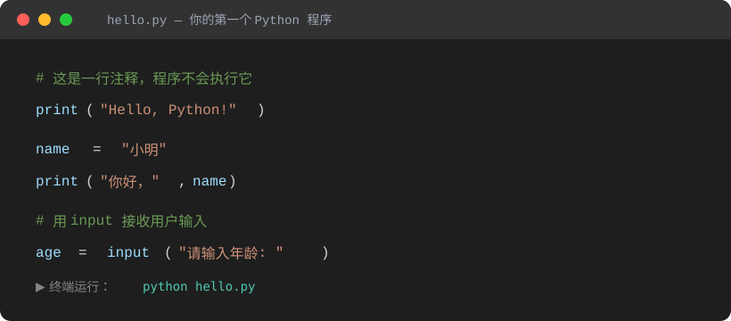
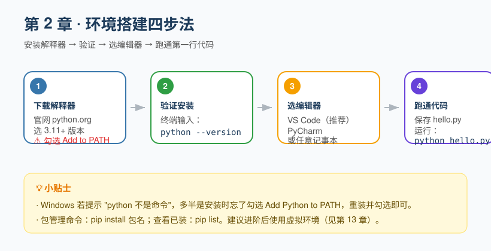

## 第 2 章 环境搭建：安装 Python 与开发工具

**Chapter 2: Environment Setup: Installing Python and Development Tools**

在写第一行代码前，我们需要先把"厨房"准备好：安装 Python 解释器（相当于灶台），并选一个顺手的编辑器（相当于锅铲）。

Before writing our first line of code, we need to get the "kitchen" ready: install the Python interpreter (the stove) and pick an editor that feels comfortable (the spatula).

### 2.1 安装 Python

**2.1 Installing Python**

1. 打开浏览器访问 [python.org](https://www.python.org)，点击 **Downloads**，网站会自动推荐适合你系统的版本（Windows / macOS / Linux）。
1. Open your browser and go to [python.org](https://www.python.org), click **Downloads**, and the site will automatically recommend the right version for your system (Windows / macOS / Linux).
2. 下载并运行安装包。
2. Download and run the installer.
3. **最关键的一步**：在安装界面底部，务必勾选 **"Add Python to PATH"**（把 Python 加到环境变量），否则装完后在命令行里敲 `python` 会提示"找不到命令"。
3. **The most critical step**: at the bottom of the installer window, be sure to check **"Add Python to PATH"**, otherwise typing `python` in the command line after installation will report "command not found."

> 建议安装 **Python 3.10 及以上**版本。注意：Python 2 已经在 2020 年停止维护，请务必使用 Python 3。

> We recommend installing **Python 3.10 or later**. Note: Python 2 reached end of life in 2020, so be sure to use Python 3.

### 2.2 验证安装

**2.2 Verifying the Installation**

安装完成后，打开**终端**（Windows 叫"命令提示符"或 PowerShell，macOS 叫"终端"），输入：

Once installation is complete, open a **terminal** (called "Command Prompt" or PowerShell on Windows, "Terminal" on macOS) and type:

```bash
python --version
```

如果看到类似 `Python 3.12.1` 的输出版本号，恭喜，灶台点着了。

If you see a version number like `Python 3.12.1`, congratulations—the stove is lit.

> 个别系统（如 macOS）可能需要输入 `python3 --version`。后文统一用 `python`，如果你的系统认 `python3`，请自行替换。

> On some systems (such as macOS) you may need to type `python3 --version`. The rest of this book uses `python` throughout; if your system expects `python3`, substitute it accordingly.

### 2.3 选择编辑器

**2.3 Choosing an Editor**

- **VS Code（强烈推荐初学者）**：免费、轻量、插件丰富，装上 Python 插件后拥有智能提示、调试、运行一体化体验。
- **VS Code (highly recommended for beginners)**: free, lightweight, and rich in extensions—install the Python extension and you get code completion, debugging, and running all in one place.
- **PyCharm**：功能更全的专用 IDE，社区版免费，适合后续做大型项目。
- **PyCharm**: a more fully featured dedicated IDE, free in the Community Edition, well suited to larger projects later on.
- 哪怕是系统自带的"记事本"也能写，但**强烈不建议**——没有语法高亮和提示，容易因为看不见的小错误抓狂。
- You *can* even write code in the built-in Notepad, but this is **strongly discouraged**—without syntax highlighting or hints, tiny invisible mistakes will drive you up the wall.

### 2.4 跑通第一行代码

**2.4 Running Your First Line of Code**

新建一个文件，命名为 `hello.py`，输入以下内容（也可以直接参考下面的代码截图）：

Create a new file named `hello.py` and enter the following (you can also refer to the code screenshot below):



```python
# 这是一行注释，程序不会执行它
print("Hello, Python!")

name = "小明"
print("你好，", name)

# 用 input 接收用户输入
age = input("请输入年龄: ")
```

在终端进入该文件所在目录，运行：

In the terminal, navigate to the directory containing the file and run:

```bash
python hello.py
```

看到输出，说明你的开发环境已经完全就绪。

Once you see the output, your development environment is fully ready.



---

