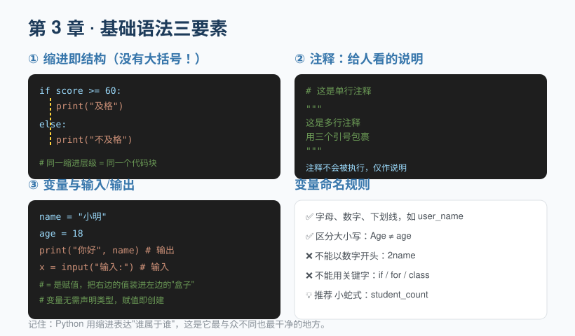

## 第 3 章 基础语法：变量、注释、缩进、输入输出

**Chapter 3: Basic Syntax: Variables, Comments, Indentation, Input and Output**

任何编程语言都有"基本功"。Python 的基本功可以浓缩为三件事：**怎么写注释、怎么用缩进、怎么存数据和交互**。

Every programming language has its fundamentals. Python's boil down to three things: **how to write comments, how to use indentation, and how to store data and interact with the user**.

### 3.1 变量：装数据的"盒子"

**3.1 Variables: "Boxes" That Hold Data**

变量就是给数据贴的一个名字标签。你不需要提前声明"这个变量是什么类型"，直接赋值就行：

A variable is simply a name tag attached to a piece of data. You don't need to declare "what type this variable is" in advance—just assign a value:

```python
age = 18          # 整数
price = 9.9       # 浮点数
name = "小明"      # 字符串
is_student = True # 布尔值
```

`=` 在编程里叫**赋值运算符**，意思是"把右边的值，装进左边的盒子"。注意它和数学里的"等于"不同——`x = x + 1` 在程序里完全合法，意思是"取 x 当前的值加 1，再存回 x"。

In programming, `=` is called the **assignment operator**, meaning "put the value on the right into the box on the left." Note that this differs from "equals" in mathematics—`x = x + 1` is perfectly legal in a program, and it means "take x's current value, add 1, and store the result back into x."

变量命名规则：

Rules for naming variables:

- 只能包含字母、数字、下划线，且**不能以数字开头**（`2name` ❌，`name2` ✅）。- 区分大小写：`Age` 和 `age` 是两个不同的变量。
- Names may contain only letters, digits, and underscores, and **must not start with a digit** (`2name` ❌, `name2` ✅). - Names are case-sensitive: `Age` and `age` are two different variables.
- 不能用 Python 的**关键字**（如 `if`、`for`、`class`）做名字。
- You cannot use Python **keywords** (such as `if`, `for`, `class`) as names.
- 推荐使用**小蛇式命名**：`student_count`、`user_name`，全小写加下划线，清晰易懂。
- Prefer **snake_case**: `student_count`, `user_name`—all lowercase with underscores, clear and easy to read.

### 3.2 注释：写给人看的说明

**3.2 Comments: Notes Written for Humans**

注释是写给读代码的人（包括未来的你）看的，程序运行时会直接忽略它。

Comments are written for whoever reads the code (including your future self); the program ignores them entirely at runtime.

```python
# 这是单行注释，以 # 开头

"""
这是多行注释，
用三个引号（单双都可）包裹，
常用于函数或文件的说明
"""
```

好的注释不是解释"代码做了什么"（代码自己会说话），而是解释"**为什么**要这么做"。

A good comment doesn't explain *what* the code does (the code speaks for itself)—it explains **why** it's done that way.

### 3.3 缩进：Python 的"大括号"

**3.3 Indentation: Python's "Curly Braces"**

很多语言用 `{}` 来表示"哪些代码属于一起"，而 Python 用**缩进**（行首的空格）。这是 Python 最与众不同、也最干净的设计：

Many languages use `{}` to mark "which lines of code belong together," whereas Python uses **indentation** (spaces at the start of a line). This is Python's most distinctive—and cleanest—design decision:



```python
if score >= 60:
    print("及格")        # 这行缩进了，属于 if 代码块
    print("恭喜")        # 同样缩进，也属于 if
print("这句话没有缩进")   # 这行顶格，无论 if 是否成立都会执行
```

**缩进规则要点**：

**Key points about indentation**:

- 同一代码块内的缩进量必须一致（通常 4 个空格，不要用 Tab 和空格混用）。
- Indentation must be consistent within the same block (usually 4 spaces—never mix tabs and spaces).
- 推荐用编辑器自动把 Tab 转成 4 个空格，避免"看起来对齐实则没对齐"的报错。
- Configure your editor to convert tabs into 4 spaces automatically, to avoid errors where code "looks aligned but isn't."

### 3.4 输入与输出

**3.4 Input and Output**

- `print(...)` 把内容显示在屏幕上。
- `print(...)` displays content on the screen.
- `input("提示语")` 暂停程序，等用户从键盘输入，并把输入内容作为**字符串**返回。
- `input("prompt")` pauses the program, waits for the user to type on the keyboard, and returns what they entered as a **string**.

```python
name = input("你叫什么名字？")
print("你好，", name)
```

> 注意：`input()` 永远返回字符串。如果你想做数学运算，记得用 `int()` 或 `float()` 转换类型，比如 `age = int(input("年龄："))`。

> Note: `input()` always returns a string. If you want to do arithmetic, remember to convert the type with `int()` or `float()`, for example `age = int(input("年龄："))`.

### 3.5 变量的底层细节：id、is 与 ==、可变与不可变

**3.5 Under the Hood: id, is vs. ==, Mutable vs. Immutable**

很多初学者以为"变量是一个装数据的盒子"，这个比喻好懂但并不完整。更准确地说：**变量是贴在对象上的"标签"，真正的对象存在于内存里。**

Many beginners picture a variable as "a box holding data." That metaphor is easy to grasp but incomplete. More precisely: **a variable is a "label" stuck onto an object, while the object itself lives in memory.**

```python
x = 10
print(id(x))        # 打印 x 指向的对象在内存里的"身份证号"
y = x
print(x is y)       # True   —— is 判断"是不是同一个对象"
print(x == y)       # True   —— == 判断"值是否相等"
```

要点：

Key points:

- `id()` 返回一个对象在内存中的唯一编号；`is` 比较编号（是否为同一对象），`==` 比较值。
- `id()` returns an object's unique number in memory; `is` compares those numbers (whether they are the same object), while `==` compares values.
- 把变量赋给另一个变量（`y = x`），只是让 `y` 也贴上同一个对象，**并不会复制一份**。
- Assigning one variable to another (`y = x`) merely attaches `y` to the same object—it **does not make a copy**.
- 因此**可变对象**（列表、字典、集合）被多个变量指向时，改一个全都跟着变；**不可变对象**（数字、字符串、元组）"改不了"，任何"修改"其实都生成了新对象。
- Consequently, when a **mutable object** (list, dict, set) is referenced by several variables, changing it through one of them changes it for all; **immutable objects** (numbers, strings, tuples) "can't be changed"—any apparent "modification" actually creates a new object.

```python
s = "abc"
t = s
s = s + "d"         # 字符串不可变，这里生成新对象 "abcd"，t 仍指向旧对象
print(t)            # abc   t 不受影响

a = [1, 2]
b = a
b.append(3)
print(a)            # [1, 2, 3]   a 被牵连，因为 a、b 指向同一个列表
```

> ⚠️ **常见误区**：用 `is` 比较值。例如 `a = 257; b = 257; a is b` 可能返回 `False`（Python 只缓存了小整数 -5~256）。比较值永远用 `==`。

> ⚠️ **Common pitfall**: using `is` to compare values. For example, `a = 257; b = 257; a is b` may return `False` (Python only caches small integers from -5 to 256). Always use `==` to compare values.

> ✏️ **小练习**：定义 `a = [1, 2]; b = a; b[0] = 99`，打印 `a` 并解释为什么它变了；再试 `a = 5; b = a; b = 6`，打印 `a` 看是否变化，对比两者的差异。

> ✏️ **Exercise**: define `a = [1, 2]; b = a; b[0] = 99`, print `a`, and explain why it changed; then try `a = 5; b = a; b = 6`, print `a` to see whether it changed, and compare the difference between the two cases.

---

