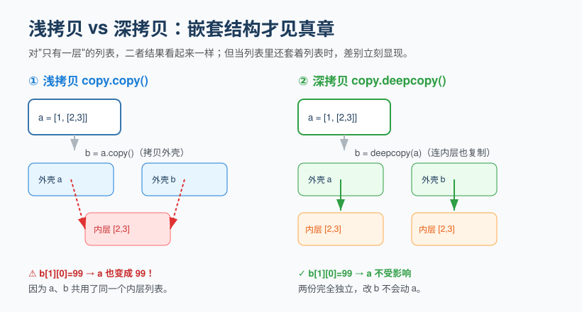

## 第 5 章 数据类型（二）：列表、元组、集合、字典

**Chapter 5: Data Types (2): List, Tuple, Set, Dict**

这四种是"容器型"数据类型，能帮你把一堆数据有序或结构化地组织起来。

These four are "container" data types that help you organize a bunch of data in an ordered or structured way.


### 5.1 列表 list：最常用容器

**5.1 List: The Most Common Container**

列表用方括号 `[]` 表示，元素之间用逗号隔开。**有序、可重复、可变**（能增删改）。

A list is denoted by square brackets `[]`, with elements separated by commas. It is **ordered, allows duplicates, and is mutable** (elements can be added, deleted, or changed).

```python
fruits = ["苹果", "香蕉", "橙子"]
print(fruits[0])        # 苹果   按下标取
fruits.append("西瓜")    # 末尾追加
fruits[1] = "葡萄"       # 修改下标 1 的元素
fruits.remove("苹果")    # 按值删除
print(len(fruits))      # 当前元素个数
print("西瓜" in fruits)  # True  判断是否存在
```

列表常用操作速查：

Quick reference for common list operations:

| 操作 | 写法 | 说明 |
| --- | --- | --- |
| 追加 | `ls.append(x)` | 加到末尾 |
| 插入 | `ls.insert(i, x)` | 在下标 i 处插入 |
| 删除末尾 | `ls.pop()` | 返回并移除最后一个 |
| 删除指定 | `ls.remove(x)` | 按值删除第一个 |
| 排序 | `ls.sort()` | 原地排序 |
| 反转 | `ls.reverse()` | 原地反转 |

| Operation | Syntax | Description |
| --- | --- | --- |
| Append | `ls.append(x)` | Add to the end |
| Insert | `ls.insert(i, x)` | Insert at index i |
| Pop last | `ls.pop()` | Return and remove the last item |
| Remove by value | `ls.remove(x)` | Remove first occurrence by value |
| Sort | `ls.sort()` | Sort in place |
| Reverse | `ls.reverse()` | Reverse in place |

**列表推导式**（Python 优雅写法，强烈推荐掌握）：

**List comprehensions** (an elegant Python idiom, highly recommended to master):

```python
# 生成 0~9 的平方
squares = [x * x for x in range(10)]
print(squares)  # [0, 1, 4, 9, 16, 25, 36, 49, 64, 81]

# 只保留偶数
evens = [x for x in range(10) if x % 2 == 0]
```

### 5.2 元组 tuple：只读列表

**5.2 Tuple: Read-Only List**

元组用圆括号 `()` 表示，**一旦创建不能修改**。适合存放"不应该被改变"的数据，比如坐标、配置项。

A tuple is denoted by parentheses `()`. **Once created, it cannot be modified.** It is suitable for storing data that should not change, such as coordinates or configuration items.

```python
point = (3, 5)
print(point[0])   # 3
# point[0] = 10   # 报错！元组不可修改
```

> 什么时候用元组？当你希望数据保持固定、不被意外改动时。函数返回多个值时，本质上返回的就是一个元组。

> When should you use a tuple? When you want the data to stay fixed and avoid accidental changes. When a function returns multiple values, it is essentially returning a tuple.

### 5.3 集合 set：去重利器

**5.3 Set: The Deduplication Tool**

集合用花括号 `{}`（但要注意空集合不能用 `{}`，要用 `set()`），**无序、不重复、可变**。

A set is denoted by curly braces `{}` (but note that an empty set cannot use `{}`—you must use `set()`). It is **unordered, does not allow duplicates, and is mutable**.

```python
s = {1, 2, 3, 2, 1}
print(s)          # {1, 2, 3}  自动去重

# 经典用法：快速去重
nums = [1, 2, 2, 3, 3, 3]
unique = list(set(nums))   # [1, 2, 3]

s.add(4)         # 添加元素
print(2 in s)    # True  判断成员极快
```

### 5.4 字典 dict：键值对

**5.4 Dict: Key–Value Pairs**

字典是 Python 里最强大的数据结构之一，用花括号 `{}` 包裹，内部是 `键: 值` 的映射，像真正的字典——用"词"查"释义"。

A dictionary is one of the most powerful data structures in Python. It is wrapped in curly braces `{}` and stores a `key: value` mapping, much like a real dictionary—you look up a "definition" by its "word".

```python
student = {
    "name": "小明",
    "age": 18,
    "score": 95
}
print(student["name"])     # 小明   按键取值
student["age"] = 19        # 修改
student["city"] = "北京"    # 新增键值对
print(student.get("phone", "无"))  # 无  取不到时给默认值，不会报错

for key, value in student.items():
    print(key, "=", value)
```

> 字典的键必须是不可变类型（通常用字符串），值可以是任意类型。它特别适合表示"一条记录""一份配置""一次接口返回的数据"。

> A dictionary's keys must be of an immutable type (usually strings), while values can be of any type. It is especially well suited for representing "a record", "a configuration", or "data returned from an API".

### 5.5 类型转换

**5.5 Type Conversion**

不同类型之间可以互相转换，这在处理用户输入、文件数据时极为常见：

Conversion between different types is very common when handling user input or file data:

```python
int("10")      # 10
str(18)        # "18"
float("3.5")   # 3.5
list("abc")    # ['a', 'b', 'c']
tuple([1,2,3]) # (1, 2, 3)
set([1,1,2])   # {1, 2}
```

> 转换失败会抛异常，例如 `int("abc")` 会报 `ValueError`。这正是下一章控制流和后续异常处理要解决的问题。

> A failed conversion raises an exception—for example, `int("abc")` raises `ValueError`. This is exactly what the next chapter on control flow and the later error-handling section will address.

### 5.6 容器进阶：切片、拷贝与选型

**5.6 Containers Advanced: Slicing, Copying, and Choosing**

**(1) 切片（slice）**——对字符串和列表都能"切下一段"，规则是「含头不含尾」：

**(1) Slicing**—you can "cut out a section" from both strings and lists. The rule is "include the start, exclude the end".


```python
ls = [0, 1, 2, 3, 4, 5]
print(ls[1:4])    # [1, 2, 3]   取下标 1、2、3（不含 4）
print(ls[:3])     # [0, 1, 2]   起点省略 = 从头
print(ls[::2])    # [0, 2, 4]   步长 2
print(ls[::-1])   # [5, 4, 3, 2, 1, 0]  步长为负 = 反转
```

**(2) 拷贝陷阱：浅拷贝 vs 深拷贝**。对"只有一层"的列表，两者没差别；但当列表里还套着列表时，浅拷贝会留下隐患：

**(2) The copy trap: shallow copy vs. deep copy.** For a "single-level" list, the two make no difference; but when a list contains other lists, a shallow copy leaves a hidden pitfall:



```python
import copy
a = [1, [2, 3]]
b = a.copy()              # 浅拷贝：只复制了"外壳"
b[1][0] = 99
print(a)                  # [1, [99, 3]]   a 被牵连！因为 a、b 共用同一个内层列表

c = copy.deepcopy(a)      # 深拷贝：连内层也复制一份
c[1][0] = 0
print(a)                  # [1, [99, 3]]   a 不再受影响
```

**(3) 四种容器怎么选？**

**(3) How to choose among the four containers?**

| 你的需求 | 选 | 原因 |
| --- | --- | --- |
| 有序、可改、可重复 | 列表 `list` | 最通用 |
| 有序、不可改 | 元组 `tuple` | 配置/固定数据 |
| 去重、做集合运算 | 集合 `set` | 成员判断极快 |
| 键值映射 / 一条记录 | 字典 `dict` | 按名字取数 |

| Your need | Choose | Reason |
| --- | --- | --- |
| Ordered, mutable, duplicable | `list` | Most general-purpose |
| Ordered, immutable | `tuple` | Config / fixed data |
| Deduplication, set operations | `set` | Extremely fast membership test |
| Key–value mapping / a record | `dict` | Look up by name |

**(4) 字典推导式**（和列表推导式同理，只是产出键值对）：

**(4) Dictionary comprehensions** (same idea as list comprehensions, but produce key–value pairs):

```python
squares = {x: x * x for x in range(5)}
# {0: 0, 1: 1, 2: 4, 3: 9, 4: 16}
```

> ⚠️ **常见误区**：以为 `list2 = list1` 是复制。其实这只是让两个变量指向同一个列表，改 `list2` 会动 `list1`。真正想要独立副本请用 `list1.copy()` 或 `list1[:]`。

> ⚠️ **Common pitfall**: thinking that `list2 = list1` makes a copy. In fact this only makes two variables point to the same list, so changing `list2` also changes `list1`. To get a truly independent copy, use `list1.copy()` or `list1[:]`.

> ✏️ **小练习**：用集合对 `[1, 1, 2, 2, 3]` 去重，并排序后输出；再写一个字典推导式，把 `["a", "bb", "ccc"]` 变成 `{字: 长度}` 的形式。

> ✏️ **Exercise**: Use a set to deduplicate `[1, 1, 2, 2, 3]`, then sort and print the result. Also write a dictionary comprehension that turns `["a", "bb", "ccc"]` into a `{char: length}` mapping.

---

