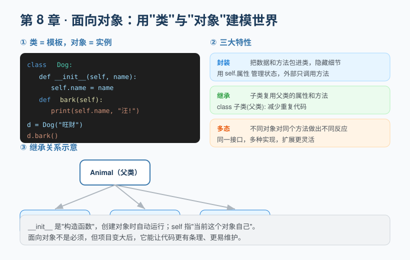
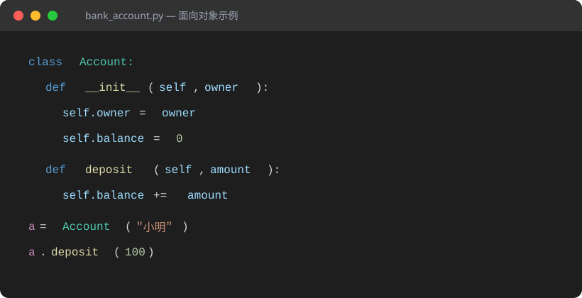

## 第 8 章 面向对象编程：用类与对象组织代码

**Chapter 8: Object-Oriented Programming: Organizing Code with Classes and Objects**

当程序变大，单纯用函数和变量会越来越难管理。**面向对象（OOP）** 是一种把"数据"和"操作数据的方法"打包在一起的编程思想，特别适合建模现实世界。

As programs grow, managing things with only functions and variables becomes harder and harder. **Object-oriented programming (OOP)** is a way of thinking that bundles "data" together with the "methods that operate on that data". It is especially well suited to modeling the real world.



### 8.1 类与对象

**8.1 Classes and Objects**

- **类（Class）**：一类事物的"模板"或"图纸"，比如"狗"这个抽象概念。
- **Class**: the "template" or "blueprint" for a category of things, such as the abstract concept of a "dog".
- **对象（Object）**：根据类创建出来的具体实例，比如"旺财"这只具体的狗。
- **Object**: a concrete instance created from a class, such as the specific dog named "Wangcai".

```python
class Dog:
    def __init__(self, name):   # 构造函数，创建时自动运行
        self.name = name         # self 指"当前这个对象"

    def bark(self):              # 方法（类里的函数）
        print(self.name, "汪!")

d = Dog("旺财")   # 创建对象
d.bark()          # 旺财 汪!
```

下面用一张"代码截图"再看一遍完整结构，对照着读会更直观：

Below is a "code screenshot" showing the complete structure again; reading it side by side is more intuitive:



- `__init__` 是特殊方法（构造函数），每当用 `Dog(...)` 创建对象时自动调用。
- `__init__` is a special method (the constructor) that is called automatically whenever an object is created with `Dog(...)`.
- `self` 代表"当前这个对象自己"，方法里要通过 `self.属性` 访问自己的数据。
- `self` stands for "the current object itself"; inside a method you access its own data via `self.attribute`.

### 8.2 封装

**8.2 Encapsulation**

封装是把数据和方法包进类里，并控制外部访问。常用**约定**来保护内部数据：

Encapsulation packs data and methods into a class and controls external access. A common **convention** is used to protect internal data:

```python
class BankAccount:
    def __init__(self, owner):
        self.owner = owner
        self.__balance = 0     # 双下划线开头，表示"私有"，外部不应直接改

    def deposit(self, amount):
        self.__balance += amount

    def get_balance(self):
        return self.__balance

acc = BankAccount("小明")
acc.deposit(100)
print(acc.get_balance())   # 100
```

> 封装的意义：外部不能直接乱改余额，必须通过 `deposit` 这类受控方法操作，保证数据始终合理。

> The point of encapsulation: the outside world cannot freely tamper with the balance; it must go through controlled methods like `deposit`, keeping the data always valid.

### 8.3 继承

**8.3 Inheritance**

子类可以继承父类的属性和方法，避免重复代码：

A subclass can inherit the attributes and methods of its parent class, avoiding duplicated code:

```python
class Animal:
    def __init__(self, name):
        self.name = name
    def speak(self):
        pass

class Dog(Animal):              # Dog 继承 Animal
    def speak(self):
        print(self.name, "汪!")

class Cat(Animal):
    def speak(self):
        print(self.name, "喵!")

d = Dog("旺财")
c = Cat("咪咪")
d.speak()   # 旺财 汪!
c.speak()   # 咪咪 喵!
```

### 8.4 多态

**8.4 Polymorphism**

**多态**让"同一个接口，不同对象有不同表现"。上面 `Dog` 和 `Cat` 都有 `speak()`，但叫出来的声音不同——调用方只管调 `speak()`，无需关心具体是哪类动物。这让代码在扩展新类型时非常灵活。

**Polymorphism** means "the same interface, different behavior for different objects". Both `Dog` and `Cat` above have a `speak()`, but they make different sounds—the caller just calls `speak()` without caring which animal it is. This makes the code very flexible when extending with new types.

```python
animals = [Dog("旺财"), Cat("咪咪")]
for a in animals:
    a.speak()    # 旺财 汪!  /  咪咪 喵!
```

### 8.5 类进阶：类变量、\_\_str\_\_ 与 super

**8.5 Classes Advanced: Class Variables, \_\_str\_\_, and super**

**(1) 类变量 vs 实例变量**：类变量写在类下面、方法外面，被所有实例**共享**；实例变量写在 `__init__` 里用 `self.` 开头，每个对象**各一份**。

**(1) Class variables vs. instance variables**: a class variable is written under the class but outside any method and is **shared** by all instances; an instance variable is written inside `__init__` starting with `self.` and each object gets **its own copy**.

```python
class Student:
    school = "第一中学"        # 类变量（共享）
    def __init__(self, name):
        self.name = name      # 实例变量（各自一份）

s1 = Student("小明")
s2 = Student("小红")
print(s1.school, s2.school)   # 第一中学 第一中学
Student.school = "第二中学"    # 改类变量，所有实例一起变
print(s1.school, s2.school)   # 第二中学 第二中学
```

**(2) `__str__`**：定义当你 `print(对象)` 时应该显示什么，让调试输出更友好。

**(2) `__str__`**: defines what should be shown when you `print(an object)`, making debug output friendlier.

```python
class Point:
    def __init__(self, x, y):
        self.x, self.y = x, y
    def __str__(self):
        return f"Point({self.x}, {self.y})"

print(Point(3, 5))   # Point(3, 5)   不写 __str__ 会显示难以阅读的内存信息
```

**(3) `super()`**：在子类里调用父类的方法，避免把父类名写死（改父类名时更安全）。

**(3) `super()`**: calls a parent-class method from within a subclass, avoiding hard-coding the parent's name (safer when the parent is renamed).

```python
class Animal:
    def speak(self):
        print("发出声音")

class Dog(Animal):
    def speak(self):
        super().speak()        # 先调用父类的 speak
        print("汪!")

Dog().speak()    # 发出声音  /  汪!
```

> ⚠️ **常见误区**：把"可变类变量"（如列表）当成实例变量用。多个实例会共享并互相干扰，结果常常出乎意料。简单数据用类变量，跟个体有关的数据务必放进 `__init__` 的 `self.` 里。

> ⚠️ **Common pitfall**: using a "mutable class variable" (such as a list) as if it were an instance variable. Multiple instances will share and interfere with it, often producing surprising results. Use class variables for simple shared data, but put individual-specific data into `self.` inside `__init__`.

> ✏️ **小练习**：给本章 8.1 节的 `Dog` 类加上 `__str__`，让 `print(d)` 输出形如 `狗狗：旺财` 的文字；再写一个子类 `Puppy(Dog)`，用 `super()` 在构造时多打印一句"这是小狗"。

> ✏️ **Exercise**: add `__str__` to the `Dog` class from section 8.1 so that `print(d)` outputs something like `Dog: Wangcai`. Then write a subclass `Puppy(Dog)` that uses `super()` to print an extra line "This is a puppy" during construction.

---

