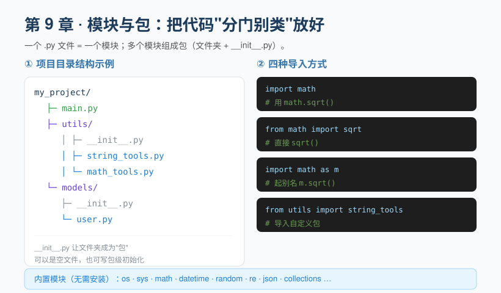

## 第 9 章 模块与包：组织大型项目

**Chapter 9: Modules and Packages: Organizing Large Projects**

随着代码变多，把所有东西塞进一个文件会难以维护。Python 用**模块**和**包**来分门别类地组织代码。

As your code grows, stuffing everything into a single file becomes hard to maintain. Python uses **modules** and **packages** to organize code into clear, separate categories.

- **模块（module）**：一个 `.py` 文件就是一个模块。
- **Module**: A `.py` file is a module.

- **包（package）**：一个包含 `__init__.py` 的文件夹，里面可以放多个模块。
- **Package**: A folder containing `__init__.py` that can hold multiple modules.



### 9.1 导入的四种方式
**9.1 Four Ways to Import**

```python
import math                      # 导入整个模块
print(math.sqrt(16))

from math import sqrt            # 只导入某个函数，可直接用
print(sqrt(16))

import math as m                 # 起别名
print(m.sqrt(16))

from utils import string_tools  # 导入自定义包里的模块
```

### 9.2 自定义模块与包
**9.2 Custom Modules and Packages**

假设你的项目结构如下：

Suppose your project structure looks like this:

```
my_project/
├─ main.py
├─ utils/
│  ├─ __init__.py
│  ├─ string_tools.py
│  └─ math_tools.py
└─ models/
   ├─ __init__.py
   └─ user.py
```

在 `main.py` 里可以这样用：

In `main.py`, you can use them like this:

```python
from utils import string_tools
from models.user import User

print(string_tools.reverse("hello"))  # olleh
u = User("小明")
```

> `__init__.py` 可以是空文件，它的存在告诉 Python"这个文件夹是一个包"。现代 Python（3.3+）即使没有它也能当包用，但保留它是个好习惯，还能在里面写包级初始化逻辑。

> `__init__.py` can be an empty file; its presence tells Python "this folder is a package." Modern Python (3.3+) can treat a folder as a package even without it, but keeping the file is good practice—you can also put package-level initialization logic inside it.

### 9.3 第三方库与 pip
**9.3 Third-Party Libraries and pip**

除自带的标准库外，还有海量**第三方库**。用 `pip`（Python 的包管理工具）安装：

Beyond the built-in standard library, there is a vast collection of **third-party libraries**. Install them with `pip` (Python's package manager):

```bash
pip install requests      # 安装
pip list                  # 查看已装
pip uninstall requests    # 卸载
```

> 进阶后强烈建议使用**虚拟环境**（见第 13 章），避免不同项目的库版本互相冲突。

> Once you advance further, we strongly recommend using a **virtual environment** (see Chapter 13) to avoid library-version conflicts between different projects.

### 9.4 模块进阶：相对导入与依赖清单
**9.4 Advanced Modules: Relative Imports and Dependency Lists**

**(1) 相对导入**：在一个包的内部，用 `.` 表示"当前包"，`..` 表示"上一层包"，适合包内模块互相引用。

**(1) Relative imports**: Inside a package, use `.` to mean "the current package" and `..` to mean "the parent package"—handy for modules within a package to reference one another.

```python
from .string_tools import reverse        # 从当前包导入
from ..models.user import User           # 从上层包导入
```

> 注意：相对导入只能在"被当作包的一部分"时使用（即通过 `import 包名.模块` 触发），直接用 `python 模块.py` 单独运行该文件会报错。

> Note: Relative imports only work when the module is "treated as part of a package" (i.e., triggered via `import package.module`). Running the file directly with `python module.py` will raise an error.

**(2) 依赖清单 `requirements.txt`**：记录项目用到的第三方库及版本，方便别人一键复现你的环境。

**(2) Dependency list `requirements.txt`**: Records the third-party libraries and versions your project uses, making it easy for others to reproduce your environment with a single command.

```bash
pip freeze > requirements.txt        # 导出当前环境所有已装库及版本
pip install -r requirements.txt      # 别人据此安装完全相同的版本
```

**(3) `if __name__ == "__main__"` 在模块里也很常用**：把"测试代码"放在这里，保证文件被导入时不会自动执行，只有单独运行时才跑。

**(3) `if __name__ == "__main__"` is also very common in modules**: Put "test code" here to ensure it won't run automatically when the file is imported—it only executes when the file is run on its own.

> ✏️ **小练习**：运行 `pip list` 看看你环境里有哪些库，挑两个（例如 `pip` 和自己装过的）写进一份 `requirements.txt`；再新建一个文件，体验用 `from 文件名 import 函数名` 复用另一个文件的代码。

> ✏️ **Exercise**: Run `pip list` to see which libraries are in your environment, pick two (for example `pip` and one you installed) and write them into a `requirements.txt`; then create a new file and try reusing code from another file with `from filename import function_name`.

---

