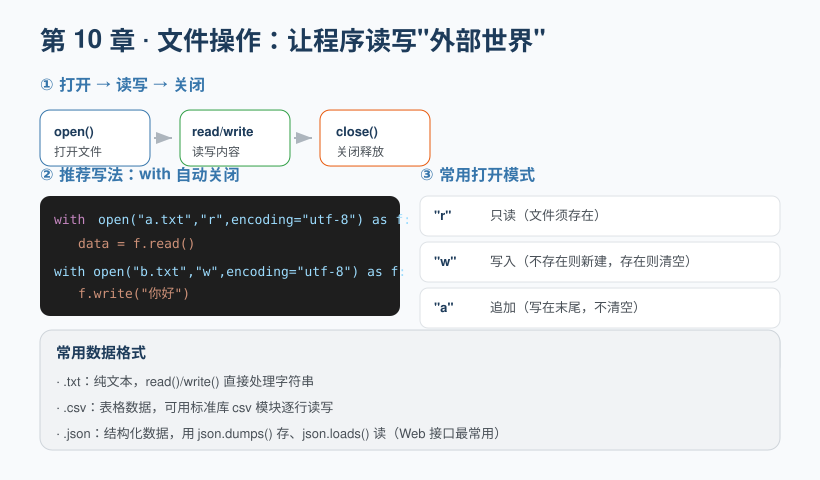

## 第 10 章 文件操作：读写数据

**Chapter 10: File Operations: Reading and Writing Data**

程序运行中产生的数据，默认只存在于内存里，一关程序就丢了。**文件操作**让程序能把数据存到硬盘（持久化），或读取外部文件。

By default, data produced while a program runs lives only in memory and is lost once the program closes. **File operations** let a program persist data to disk or read external files.



### 10.1 打开 → 读写 → 关闭
**10.1 Open → Read/Write → Close**

最基础的三步：

The three most basic steps:

```python
f = open("note.txt", "r", encoding="utf-8")  # 打开（只读）
data = f.read()                               # 读取
f.close()                                     # 关闭（释放资源）
```

但**忘记关闭文件**是常见隐患。所以推荐用 `with` 语句，它会在代码块结束后**自动关闭**：

But **forgetting to close the file** is a common pitfall. So we recommend the `with` statement, which **closes the file automatically** when the block ends:

```python
with open("note.txt", "r", encoding="utf-8") as f:
    data = f.read()
    print(data)
# 离开 with 块，文件自动关闭，无需手动 close
```

### 10.2 打开模式
**10.2 Open Modes**

| 模式 | 含义 |
| --- | --- |
| `"r"` | 只读（文件必须存在） |
| `"w"` | 写入（不存在则新建，存在则**清空**原内容） |
| `"a"` | 追加（写在末尾，不清空） |
| `"rb"` / `"wb"` | 二进制读写（图片、视频等） |

| Mode | Meaning |
| --- | --- |
| `"r"` | Read-only (the file must exist) |
| `"w"` | Write (creates the file if missing; **clears** existing content) |
| `"a"` | Append (writes at the end without clearing) |
| `"rb"` / `"wb"` | Binary read/write (images, video, etc.) |

```python
# 写入
with open("out.txt", "w", encoding="utf-8") as f:
    f.write("你好，世界\n")
    f.write("第二行\n")

# 逐行读取
with open("out.txt", "r", encoding="utf-8") as f:
    for line in f:
        print(line.strip())   # strip() 去掉首尾空白和换行
```

> 务必指定 `encoding="utf-8"`，否则中文在非中文系统上容易变成乱码（mojibake）。

> Always specify `encoding="utf-8"`; otherwise Chinese text easily turns into garbled characters (mojibake) on non-Chinese systems.

### 10.3 处理常见数据格式
**10.3 Handling Common Data Formats**

**CSV（表格数据）**：

**CSV (tabular data)**:

```python
import csv

with open("data.csv", "w", newline="", encoding="utf-8") as f:
    writer = csv.writer(f)
    writer.writerow(["姓名", "年龄"])
    writer.writerow(["小明", 18])

with open("data.csv", "r", encoding="utf-8") as f:
    reader = csv.reader(f)
    for row in reader:
        print(row)   # ['姓名', '年龄']  ['小明', '18']
```

**JSON（结构化数据，Web 接口最常用）**：

**JSON (structured data, most common in web APIs)**:

```python
import json

data = {"name": "小明", "age": 18, "hobby": ["篮球", "音乐"]}

# 存：把 Python 对象转为 JSON 字符串写入
with open("config.json", "w", encoding="utf-8") as f:
    json.dump(data, f, ensure_ascii=False, indent=2)

# 读：把 JSON 字符串解析回 Python 对象
with open("config.json", "r", encoding="utf-8") as f:
    loaded = json.load(f)
    print(loaded["name"])   # 小明
```

> `ensure_ascii=False` 让中文正常显示而不是转成 `\uXXXX`；`indent=2` 让文件更美观。

> `ensure_ascii=False` lets Chinese display normally instead of being escaped as `\uXXXX`; `indent=2` makes the file prettier.

### 10.4 文件进阶：二进制、定位与流式读取
**10.4 Advanced Files: Binary, Seeking, and Streaming Reads**

**(1) 二进制模式 `rb` / `wb`**：图片、音频、视频、压缩包等非文本文件，必须用二进制模式读写，且**不要**指定 `encoding`。

**(1) Binary mode `rb` / `wb`**: Non-text files such as images, audio, video, and archives must be read/written in binary mode, and you should **not** specify `encoding`.

```python
with open("cat.png", "rb") as f:
    data = f.read()        # 得到 bytes（字节）类型，不是字符串
```

**(2) 定位 `seek` 与 `tell`**：像录音机的进度条，可以手动移动"读到哪了"。

**(2) Positioning with `seek` and `tell`**: Like the progress bar on a tape recorder, you can manually move "where the reading is."

```python
with open("note.txt", "r", encoding="utf-8") as f:
    f.seek(3)              # 把读取位置跳到第 3 个字节
    print(f.read(2))       # 从那里读 2 个字符
    print(f.tell())        # 打印当前位置
```

**(3) 大文件流式读取**：文件非常大（几个 GB）时，千万别用 `read()` 一次性读进内存，否则会卡死。应当逐行或分块处理，内存里始终只保留一小部分。

**(3) Streaming reads for large files**: When a file is very large (several GB), never use `read()` to load it all into memory at once, or the program will hang. Process it line by line or in chunks, keeping only a small portion in memory at any time.

```python
with open("big.log", "r", encoding="utf-8") as f:
    for line in f:         # 每次只在内存里保留一行
        process(line)      # 处理完就丢掉，再读下一行
```

**(4) 自定义上下文管理器**：`with` 之所以能自动关文件，是因为文件对象实现了"进入/退出"协议。你也能用 `@contextmanager` 让自己的资源也支持 `with`：

**(4) Custom context managers**: `with` can close files automatically because file objects implement the "enter/exit" protocol. You can also use `@contextmanager` to make your own resources support `with`:

```python
from contextlib import contextmanager

@contextmanager
def my_open(path):
    f = open(path, encoding="utf-8")
    try:
        yield f            # with 代码块里拿到的就是 f
    finally:
        f.close()          # 退出时自动关闭
```

> ✏️ **小练习**：写一个函数 `count_lines(path)`，用逐行读取的方式统计某个文本文件共有多少行（提示：`for line in f` 每轮就是一行，计数加一即可）。

> ✏️ **Exercise**: Write a function `count_lines(path)` that counts how many lines a text file has by reading it line by line (hint: each iteration of `for line in f` is one line—just increment a counter).

---

