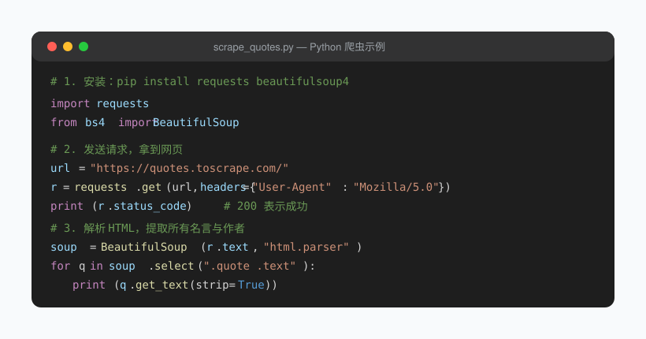

## 第 14 章 网络爬虫：让程序替你上网收集信息

**Chapter 14: Web Scraping**

很多同学学 Python 的第一个目标就是"写个爬虫"。这一章我们就把这个愿望变成现实——而且用最通俗的方式，让你真正看懂每一步在干什么。

For many learners, writing a "web scraper" is the very first goal when they start Python. In this chapter we turn that wish into reality—in the plainest way possible, so you truly understand what each step does.

### 14.1 爬虫到底是什么

**14.1 What Exactly Is a Web Scraper?**

用大白话讲：你平时用浏览器打开网页，是"人"在用眼睛看、用手复制；**爬虫就是用 Python 代码代替你"打开网页、再把里面的内容复制下来"**。

In plain words: when you open a web page in a browser, a "human" reads it with their eyes and copies by hand. **A scraper uses Python code to do that "open the page and copy its content" job for you.**

它的典型流程只有四步（看图就懂）：

Its typical workflow has just four steps (you'll get it from the diagram):

1. **发送请求**：用 `requests` 告诉网站服务器"我要看这个页面"。
1. **Send the request**: use `requests` to tell the website's server "I want to see this page."
2. **获取响应**：服务器把网页的 HTML 代码发回来。
2. **Get the response**: the server sends the page's HTML code back.
3. **解析提取**：用 `BeautifulSoup` 从 HTML 里挑出你想要的字段（比如标题、价格、评论）。
3. **Parse and extract**: use `BeautifulSoup` to pick out the fields you want from the HTML (such as title, price, reviews).
4. **保存数据**：存成 `csv` / `json` 文件或数据库，供你后续分析。
4. **Save the data**: store it as a `csv` / `json` file or in a database for later analysis.


> 💡 关键认知：浏览器"看到"的是渲染后的漂亮页面，而爬虫拿到的是 **HTML 源代码**（一堆带标签的文本）。我们要做的，就是从这堆标签里把有用的文字"摘"出来。

> 💡 Key insight: What the browser "sees" is the rendered, pretty page, while what the scraper gets is the **HTML source code** (a bunch of tagged text). Our job is to "pick out" the useful text from that pile of tags.

### 14.2 爬之前先讲"规矩"：礼仪与法律

**14.2 Rules First: Etiquette and Legality**

这一点比技术更重要，请务必记住：

This point matters more than the technique itself—please keep it firmly in mind:

- **看 robots.txt**：大部分网站根目录有 `/robots.txt`（如 `https://www.xxx.com/robots.txt`），里面写明了哪些内容不允许抓取，要尊重它。
- **Check robots.txt**: most sites have a `/robots.txt` at their root (e.g. `https://www.xxx.com/robots.txt`) that states what may not be scraped—respect it.
- **控制频率**：两次请求之间加一点间隔（`time.sleep(1)`），别一秒钟发几百次请求把人家服务器压垮。
- **Control the rate**: add a small delay between requests (`time.sleep(1)`)—don't fire hundreds of requests per second and crush their server.
- **不碰红线**：不要爬取个人信息、登录后的付费/授权内容，不要把爬来的数据用于商业倒卖。**守法是底线**。
- **Never cross the red lines**: don't scrape personal information or paywalled/authorized content behind login, and don't resell scraped data commercially. **Obeying the law is the bottom line.**
- **优先用 API**：很多网站（天气、新闻、开放数据平台）提供官方接口，合法又稳定，比硬爬网页优雅得多。
- **Prefer APIs**: many sites (weather, news, open-data platforms) offer official APIs that are legal and stable—far more elegant than brute-force scraping.

### 14.3 第一步：发送 HTTP 请求（requests）

**14.3 Step 1: Sending HTTP Requests (requests)**

`requests` 是第三方库，先安装：

`requests` is a third-party library; install it first:

```bash
pip install requests
```

最基础的"打开网页"：

The most basic "open a web page":

```python
import requests

url = "https://www.baidu.com"
r = requests.get(url)          # 发送 GET 请求
print(r.status_code)           # 200 表示成功，404 表示页面不存在
print(r.text[:200])            # 网页的 HTML 源代码（这里只打印前 200 字）
```

几个新手必知的细节：

A few details every beginner must know:

- **加请求头（User-Agent）**：有些网站会拒绝"没有浏览器身份"的请求。加个头部伪装成浏览器：

- **Add a request header (User-Agent)**: some sites reject requests that have "no browser identity." Add a header to disguise your request as a browser:

```python
headers = {"User-Agent": "Mozilla/5.0 (Windows NT 10.0; Win64; x64)"}
r = requests.get(url, headers=headers)
```

- **带参数查询**：很多页面靠 `?page=2&kw=python` 这种参数区分内容，用 `params` 更干净：

- **Query with parameters**: many pages distinguish content via parameters like `?page=2&kw=python`; using `params` is cleaner:

```python
r = requests.get("https://example.com/search", params={"kw": "python", "page": 2})
print(r.url)   # 自动拼成 https://example.com/search?kw=python&page=2
```

- **返回的是 JSON**：如果是接口（不是网页），直接 `r.json()` 就能拿到字典/列表，省去解析 HTML。

- **The response is JSON**: if it's an API (not a web page), `r.json()` gives you a dict/list directly, saving you from parsing HTML.

> ⚠️ 误区：以为 `requests.get()` 拿到的就是"最终看到的数据"。其实它拿到的是 **HTML 源码**，里面的数据还藏在标签里，需要进一步"解析"才能用——这正是下一步。

> ⚠️ Misconception: thinking `requests.get()` returns the "final data you see." In fact it returns the **HTML source**, where the data is still hidden inside tags and needs further "parsing" to be usable—which is exactly the next step.

### 14.4 第二步：解析网页（BeautifulSoup）

**14.4 Step 2: Parsing Web Pages (BeautifulSoup)**

安装解析库：

Install the parsing library:

```bash
pip install beautifulsoup4 lxml
```

把 HTML 变成"可以方便查找"的对象：

Turn the HTML into an object you can easily search:

```python
from bs4 import BeautifulSoup

html = r.text
soup = BeautifulSoup(html, "html.parser")   # 用内置解析器；装了 lxml 可写 "lxml"
```

`BeautifulSoup` 提供三种常用查找方式：

`BeautifulSoup` offers three common ways to search:

| 方法 | 作用 | 示例 |
| --- | --- | --- |
| `find()` | 找**第一个**符合条件的标签 | `soup.find("h1")` |
| `find_all()` | 找**所有**符合条件的标签（返回列表） | `soup.find_all("a")` |
| `select()` | 用 **CSS 选择器**查找（最灵活） | `soup.select(".price")` |

| Method | Purpose | Example |
| --- | --- | --- |
| `find()` | Find the **first** matching tag | `soup.find("h1")` |
| `find_all()` | Find **all** matching tags (returns a list) | `soup.find_all("a")` |
| `select()` | Find using a **CSS selector** (most flexible) | `soup.select(".price")` |

提取文本与属性：

Extracting text and attributes:

```python
tag = soup.find("h1")
print(tag.get_text(strip=True))   # 标签里的文字（strip 去掉首尾空白）
print(tag["class"])               # 标签的属性，如 class

link = soup.find("a")
print(link.get("href"))           # 取出链接地址；用 get 避免属性不存在时报错
```

**CSS 选择器速记**（够用就行）：
- `div` → 所有 `<div>` 标签
- `.title` → `class="title"` 的元素
- `#main` → `id="main"` 的元素
- `div p` → `div` 里面的所有 `<p>`（后代）
- `.item .price` → `class="item"` 里面的 `class="price"`

**CSS Selector Cheat Sheet** (the essentials):
- `div` → all `<div>` tags
- `.title` → elements with `class="title"`
- `#main` → the element with `id="main"`
- `div p` → all `<p>` inside a `div` (descendants)
- `.item .price` → the `class="price"` inside `class="item"`

> 💡 怎么知道该选什么选择器？在浏览器里右键页面 → "检查"，就能看到每个元素的标签和 class，照着写即可。

> 💡 How do you know which selector to pick? Right-click the page in your browser → "Inspect," and you'll see each element's tag and class—just write your selector to match.

### 14.5 实战：爬取一个静态示例网站

**14.5 Hands-on: Scraping a Static Demo Site**

我们用专门给练习用的 [quotes.toscrape.com](http://quotes.toscrape.com)（不会给服务器造成压力，放心练）。目标：把每一条名言和作者抓下来。

We'll use [quotes.toscrape.com](http://quotes.toscrape.com), a site made specifically for practice (it won't strain the server, so practice freely). Goal: grab every quote along with its author.



完整代码：

Full code:

```python
import requests
from bs4 import BeautifulSoup

url = "https://quotes.toscrape.com/"
headers = {"User-Agent": "Mozilla/5.0"}
r = requests.get(url, headers=headers)
r.encoding = r.apparent_encoding      # 防止中文乱码（第 10 章提过）

soup = BeautifulSoup(r.text, "html.parser")
for q in soup.select(".quote"):
    text = q.select_one(".text").get_text(strip=True)      # 名言
    author = q.select_one(".author").get_text(strip=True)  # 作者
    print(f"{author}：{text}")
```

逐行解释：
- `soup.select(".quote")` 找到页面上每一条名言卡片（它们都有 `class="quote"`）。
- `soup.select(".quote")` finds each quote card on the page (they all have `class="quote"`).
- 在每张卡片里，用 `select_one(".text")` 取名言文字、`.author` 取作者。
- Inside each card, use `select_one(".text")` to get the quote text and `.author` to get the author.
- `get_text(strip=True)` 把标签去掉，只留纯文字。
- `get_text(strip=True)` strips the tags, leaving only the plain text.

> ⚠️ 误区：用 `q.find("div")` 之类"猜结构"很容易抓错。正确做法是**先去浏览器"检查"元素，确认 class 名称**，再写选择器。

> ⚠️ Misconception: "guessing the structure" with something like `q.find("div")` easily grabs the wrong thing. The right approach is to **first "inspect" the element in the browser, confirm the class names**, then write your selector.

### 14.6 进阶：分页、API 与保存

**14.6 Going Further: Pagination, APIs, and Saving**

**① 翻页抓取**：示例网站有多页，URL 形如 `/page/2`、`/page/3`。用循环拼接：

**① Paginated scraping**: the demo site has multiple pages, with URLs like `/page/2`, `/page/3`. Build them with a loop:

```python
for page in range(1, 6):                 # 抓前 5 页
    url = f"https://quotes.toscrape.com/page/{page}/"
    r = requests.get(url, headers=headers)
    # ……同样的解析逻辑……
    time.sleep(1)                        # 别忘了礼貌地间隔一下
```

**② 优先用 JSON 接口**：很多网站数据其实是通过接口返回的。如果是接口，直接：

**② Prefer JSON APIs**: much site data is actually returned through APIs. If it's an API, simply:

```python
data = r.json()        # 一步拿到结构化字典/列表，比解析 HTML 稳得多
```

**③ 把结果存起来**（复习第 10 章）：

**③ Save the results** (review Chapter 10):

```python
import csv
with open("quotes.csv", "w", newline="", encoding="utf-8") as f:
    w = csv.writer(f)
    w.writerow(["作者", "名言"])
    w.writerow([author, text])
```

### 14.7 动态页面与反爬（了解即可）

**14.7 Dynamic Pages and Anti-Scraping (Good to Know)**

- **动态渲染**：有些页面的内容是用 JavaScript 现画的，`requests` 拿到的 HTML 里根本没有数据。这时可以用 **Selenium / Playwright**（见下一章 15.7 节）等"真浏览器"工具，或者去网络面板里找它偷偷请求的 JSON 接口。
- **Dynamic rendering**: some pages draw their content with JavaScript on the fly, so the HTML `requests` gets contains no data at all. In that case you can use a "real browser" tool like **Selenium / Playwright** (see Section 15.7) or hunt down the JSON endpoint it quietly requests in the Network panel.
- **反爬机制**：网站可能通过 User-Agent、Cookie、IP 频率来拦你。记住原则——**遵守 robots.txt、控制频率、不碰敏感数据**，别去硬刚或绕过付费墙。
- **Anti-scraping**: sites may block you via User-Agent, cookies, or IP rate limits. Remember the principle—**obey robots.txt, control the rate, never touch sensitive data**—and don't try to fight or bypass paywalls.

> ⚠️ 误区：新手容易一上来就想爬难度很高的网站（登录、验证码、加密参数），结果挫败感爆棚。建议**从 quotes.toscrape.com 这类练习站开始**，把流程跑通，再逐步挑战。

> ⚠️ Misconception: beginners often jump straight at hard sites (login, CAPTCHA, encrypted parameters) and end up thoroughly frustrated. We recommend **starting with practice sites like quotes.toscrape.com**, get the pipeline working, then take on harder challenges step by step.

### ⚠️ 本章常见误区总结

**⚠️ Common Misconceptions in This Chapter**

1. 以为 `requests.get()` 返回的就是"最终数据"（其实是 HTML 源码，要解析）。
1. Thinking `requests.get()` returns the "final data" (it's actually HTML source that still needs parsing).
2. 忘记加 `headers` 被返回 403 拒绝。
2. Forgetting the `headers` and getting a 403 rejection.
3. 请求太快被封 IP（务必 `time.sleep`）。
3. Requesting too fast and getting your IP banned (always use `time.sleep`).
4. 把爬虫用于爬取个人信息或付费内容（法律红线）。
4. Using a scraper to grab personal info or paywalled content (a legal red line).

### ✏️ 小练习

**✏️ Exercises**

1. 改造 14.5 的代码，把"作者 + 名言"一起写入 `quotes.csv`（参考 14.6③）。
1. Modify the code from 14.5 to write "author + quote" together into `quotes.csv` (see 14.6③).
2. 找一个你常看的新闻/博客首页，用 `soup.select()` 把文章标题列表抓出来并打印。
2. Find a news/blog homepage you often read, and use `soup.select()` to grab and print the list of article titles.
3. （挑战）给爬虫加上"如果某页请求失败（`status_code != 200`），就跳过并 `print` 提示"的容错逻辑（提示：复习第 11 章异常处理）。
3. (Challenge) Add fault-tolerance to the scraper: "if a page request fails (`status_code != 200`), skip it and `print` a notice" (hint: review exception handling in Chapter 11).

---

