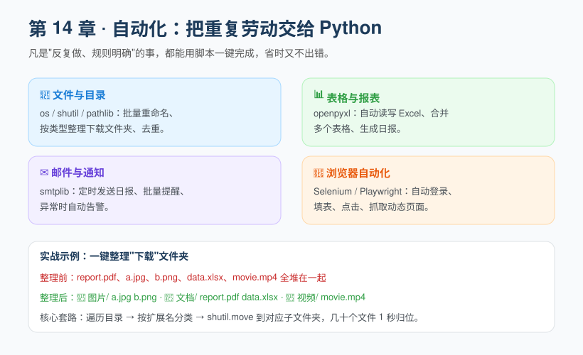

## 第 15 章 自动化办公：把重复劳动交给 Python

**Chapter 15: Office Automation**

学会爬虫能"拿数据"，而这一章教你怎么"处理数据 + 替你干活"。凡是**反复做、规则明确**的事，都值得写成脚本一键完成——省下的时间，用来喝杯咖啡不香吗？

Learning scrapers lets you "fetch data," and this chapter teaches you how to "process data + do the work for you." Anything that is **done repeatedly with clear rules** is worth turning into a one-click script—and the time you save, wouldn't a cup of coffee be nicer?



### 15.1 哪些事适合自动化

**15.1 What's Worth Automating**

判断标准很简单：**"这件事我每周/每天都要手动做，而且步骤每次都一样"**。典型例子：
- 把下载文件夹里几十个文件按类型归类；
- 把 5 个 Excel 合并成 1 个；
- 每天定时把报表邮件发给团队；
- 在网站后台自动填表、点击。

The test is simple: **"I do this manually every week/day, and the steps are always the same."** Typical examples:
- Sort dozens of files in the Downloads folder by type;
- Merge 5 Excel files into 1;
- Email the daily report to the team on a schedule;
- Auto-fill forms and click through a website's backend.

### 15.2 文件和目录操作（os / shutil / pathlib）

**15.2 File and Directory Operations (os / shutil / pathlib)**

最常用的是这三个"内置/标准"工具：

The three most commonly used "built-in/standard" tools:

| 工具 | 一句话定位 |
| --- | --- |
| `os` | 老牌系统交互，函数式风格（`os.listdir`、`os.rename`） |
| `shutil` | 高级文件操作，尤其是**移动/复制**（`shutil.move`） |
| `pathlib` | 面向对象的路径处理，**更现代、更直观**（推荐） |

| Tool | One-line description |
| --- | --- |
| `os` | Classic system interaction, functional style (`os.listdir`, `os.rename`) |
| `shutil` | High-level file operations, especially **move/copy** (`shutil.move`) |
| `pathlib` | Object-oriented path handling, **more modern and intuitive** (recommended) |

基础用法：

Basic usage:

```python
import os
from pathlib import Path

# 列出当前目录所有条目
print(os.listdir("."))

# 用 pathlib（推荐写法）
p = Path(".")                     # 当前目录
for item in p.iterdir():          # 遍历每个文件/文件夹
    print(item.name, item.suffix) # 名字、扩展名（如 .jpg）

# 判断是文件还是文件夹
if Path("a.txt").is_file():
    print("这是个文件")
```

### 15.3 实战：一键整理"下载"文件夹

**15.3 Hands-on: Tidy Your Downloads Folder in One Click**

假设你桌面上 `Downloads` 乱成一团：图片、文档、视频混在一起。写个脚本，按扩展名自动归位：

Suppose your `Downloads` folder on the desktop is a mess: images, documents, and videos all mixed together. Write a script to auto-sort them by extension:

```python
import shutil
from pathlib import Path

base = Path.home() / "Downloads"        # 你的下载文件夹
# 目标分类：扩展名 -> 子文件夹名
rules = {
    ".jpg": "图片", ".png": "图片", ".gif": "图片",
    ".pdf": "文档", ".docx": "文档", ".xlsx": "文档", ".txt": "文档",
    ".mp4": "视频", ".mov": "视频",
}

for item in base.iterdir():
    if item.is_file():
        folder = rules.get(item.suffix.lower())   # 查它属于哪类
        if folder:
            dest = base / folder
            dest.mkdir(exist_ok=True)              # 目标文件夹不存在就建
            shutil.move(str(item), str(dest / item.name))
            print(f"已移动 {item.name} -> {folder}/")
```

逐行解释：
- `Path.home() / "Downloads"` 用路径拼接得到下载目录（跨平台通用）。
- `Path.home() / "Downloads"` uses path joining to get the download directory (cross-platform).
- `rules` 是个字典：扩展名映射到分类名。
- `rules` is a dictionary mapping extensions to category names.
- `dest.mkdir(exist_ok=True)` 很关键——**文件夹不存在就创建，存在也不报错**。
- `dest.mkdir(exist_ok=True)` is crucial—**create the folder if it doesn't exist, and don't error if it does.**
- `shutil.move` 把文件搬过去。
- `shutil.move` moves the file over.

跑完之后，几十个文件 1 秒归位，再也不用担心找不到文件。

Once it finishes, dozens of files are sorted in a second, and you'll never worry about not finding a file again.

> ⚠️ 误区：移动文件前不确认目标文件夹存在，会报错。牢记 `mkdir(exist_ok=True)`。另外，**移动前最好先打印计划、确认无误再执行**，避免移错地方。

> ⚠️ Misconception: moving files without confirming the destination folder exists will error. Remember `mkdir(exist_ok=True)`. Also, **it's best to print the plan first and confirm before executing** to avoid moving things to the wrong place.

### 15.4 操作 Excel（openpyxl）

**15.4 Working with Excel (openpyxl)**

办公自动化绕不开 Excel。用 `openpyxl` 读写 `.xlsx`：

Office automation can't avoid Excel. Use `openpyxl` to read and write `.xlsx`:

```bash
pip install openpyxl
```

```python
from openpyxl import Workbook, load_workbook

# 写：新建工作簿并填数据
wb = Workbook()
ws = wb.active
ws["A1"] = "姓名"
ws["B1"] = "分数"
ws.append(["小明", 90])          # 在下一行追加一行
wb.save("成绩.xlsx")

# 读：打开已有文件，遍历每一行
wb2 = load_workbook("成绩.xlsx")
ws2 = wb2.active
for row in ws2.iter_rows(values_only=True):
    print(row)                   # ('姓名', '分数')  ('小明', 90)
```

> 💡 进阶用法：多个同结构的 Excel 合并、按条件筛选、设置单元格格式——`openpyxl` 都能做，用到时查官方文档即可。

> 💡 Advanced usage: merging multiple same-structure Excel files, filtering by condition, setting cell formats—`openpyxl` can do it all; just check the official docs when you need it.

### 15.5 自动发邮件（smtplib + email）

**15.5 Sending Email Automatically (smtplib + email)**

定时把报表发给团队，不用每天手动抄送。示例（以 QQ 邮箱为例，其它邮箱类似）：

Send reports to the team on a schedule, without manually CC-ing every day. Example (using QQ Mail; other providers are similar):

```python
import smtplib
from email.mime.text import MIMEText
from email.header import Header

msg = MIMEText("这是自动发送的日报内容", "plain", "utf-8")
msg["From"] = "你的邮箱@qq.com"
msg["To"] = "对方@qq.com"
msg["Subject"] = Header("每日日报", "utf-8")

# 注意：密码处填"授权码"，不是邮箱登录密码！
with smtplib.SMTP_SSL("smtp.qq.com", 465) as server:
    server.login("你的邮箱@qq.com", "邮箱授权码")
    server.send_message(msg)
print("邮件已发送")
```

⚠️ **安全提醒**：
- 邮箱的"登录密码"不能直接用在代码里，要去邮箱设置里开启 SMTP 并获取**授权码**。
- **绝不要把授权码写死在代码里提交到 GitHub**！正确做法是用环境变量或配置文件（且不提交）：
  ```python
  import os
  pwd = os.getenv("MAIL_PWD")    # 从环境变量读取
  ```

⚠️ **Security reminder**:
- A mailbox's "login password" can't be used directly in code; you must enable SMTP in the mail settings and obtain an **authorization code**.
- **Never hard-code the authorization code into your code and commit it to GitHub**! The right approach is to use an environment variable or config file (and not commit it):
  ```python
  import os
  pwd = os.getenv("MAIL_PWD")    # read from environment variable
  ```

### 15.6 定时运行：让脚本自己按时干活

**15.6 Scheduling: Let the Script Run on Its Own**

写好脚本后，让它在固定时间自动跑，才是真"自动化"：

Once the script is written, letting it run automatically at fixed times is what real "automation" means:

- **Python 侧（`schedule` 库）**：
  ```bash
  pip install schedule
  ```
  ```python
  import schedule, time
  def job():
      print("执行每日任务……")
  schedule.every().day.at("09:00").do(job)
  while True:
      schedule.run_pending()
      time.sleep(30)
  ```
- **系统侧（更省心）**：
  - Windows：**任务计划程序** → 创建基本任务，定时运行 `python your_script.py`。
  - macOS / Linux：**crontab**，如 `0 9 * * * /usr/bin/python3 /path/script.py`。

- **On the Python side (the `schedule` library)**:
  ```bash
  pip install schedule
  ```
  ```python
  import schedule, time
  def job():
      print("Running daily task...")
  schedule.every().day.at("09:00").do(job)
  while True:
      schedule.run_pending()
      time.sleep(30)
  ```
- **On the system side (more carefree)**:
  - Windows: **Task Scheduler** → create a basic task that runs `python your_script.py` on a schedule.
  - macOS / Linux: **crontab**, e.g. `0 9 * * * /usr/bin/python3 /path/script.py`.

> ⚠️ 误区：定时任务里用**相对路径**找文件，结果找不到——因为任务运行时的工作目录往往不是你的项目目录。解决：要么在脚本里 `os.chdir` 到正确目录，要么一律用**绝对路径**。

> ⚠️ Misconception: using **relative paths** in a scheduled task to find files, only to fail—because the working directory when the task runs is often not your project directory. Solution: either `os.chdir` to the right directory in the script, or always use **absolute paths**.

### 15.7 浏览器自动化（Selenium / Playwright）

**15.7 Browser Automation (Selenium / Playwright)**

前面爬虫遇到的"动态页面"，以及"自动登录、自动填表"，靠 `requests` 搞不定，需要**真的驱动一个浏览器**。以 Playwright 为例：

The "dynamic pages" from the scraping chapter, plus "auto-login, auto-fill forms," can't be done with `requests`—you need to **actually drive a browser**. Using Playwright as an example:

```bash
pip install playwright
playwright install        # 自动下载浏览器驱动
```

```python
from playwright.sync_api import sync_playwright

with sync_playwright() as p:
    browser = p.chromium.launch(headless=False)   # headless=False 表示能看到浏览器窗口
    page = browser.new_page()
    page.goto("https://www.baidu.com")
    page.fill("#kw", "Python 自动化")             # 在搜索框输入
    page.click("#su")                             # 点击"百度一下"
    page.wait_for_timeout(2000)                   # 等两秒看结果
    browser.close()
```

它能做的远不止搜索：自动登录后台、批量提交表单、爬取 JS 渲染的内容、做 UI 自动化测试。Selenium 思路类似，是更老牌的选择。

It can do far more than search: auto-login to backends, submit forms in bulk, scrape JS-rendered content, and run UI automation tests. Selenium works on a similar idea and is the more established choice.

> 💡 选择建议：新项目优先 **Playwright**（API 更现代、自带驱动管理）；维护老项目可能遇到 Selenium。两者理念相通。

> 💡 Choice advice: for new projects prefer **Playwright** (more modern API, built-in driver management); you may meet Selenium when maintaining older projects. The two share the same philosophy.

### 15.8 综合实战思路

**15.8 Putting It All Together**

把以上拼起来，就是一个"无人值守"的工作流：

Put the above together and you get an "unattended" workflow:

> 每天 9 点（任务计划程序）→ 脚本自动从系统导出 Excel（15.4）→ 整理/汇总数据（15.2/15.3）→ 生成日报 → 自动发邮件给团队（15.5）。

> Every day at 9 AM (Task Scheduler) → script auto-exports Excel from the system (15.4) → tidy/aggregate data (15.2/15.3) → generate the daily report → auto-email it to the team (15.5).

你只需要第一次把脚本写好，之后每天它自己跑，你只管看结果。

You only need to write the script well the first time; after that it runs on its own every day, and you just watch the results.

### ⚠️ 本章常见误区总结

**⚠️ Common Misconceptions in This Chapter**

1. 移动/重命名文件前没建好目标文件夹 → 用 `mkdir(exist_ok=True)`。
1. Moving/renaming files before creating the destination folder → use `mkdir(exist_ok=True)`.
2. 邮件用邮箱登录密码 → 要用**授权码**，且别提交到代码仓库。
2. Using the mailbox login password for email → use an **authorization code**, and don't commit it to the repo.
3. 定时任务用相对路径 → 改用绝对路径或显式 `chdir`。
3. Scheduled task using relative paths → switch to absolute paths or an explicit `chdir`.
4. 把密钥、授权码硬编码进代码 → 用环境变量。
4. Hard-coding secrets/authorization codes into code → use environment variables.

### ✏️ 小练习

**✏️ Exercises**

1. 写一个脚本，把你桌面上所有图片按"扩展名"归类到不同子文件夹（提示：结合 `pathlib` 与 `shutil.move`）。
1. Write a script that sorts all images on your desktop into different subfolders by "extension" (hint: combine `pathlib` with `shutil.move`).
2. 用 `openpyxl` 把两个结构相同的 Excel 的 Sheet 合并成一个新文件。
2. Use `openpyxl` to merge the sheets of two same-structured Excel files into a new file.
3. （挑战）写一个简单的定时任务脚本：每天固定时间把一段文字通过邮件发给你自己，验证 15.5 + 15.6 的联动。
3. (Challenge) Write a simple scheduled-task script: every day at a fixed time, email a piece of text to yourself, to verify the 15.5 + 15.6 combo.

---

